# Twinkle Children's Hospital

## User guide

For the front desk, the doctor, and the pharmacy counter.

Every screenshot is taken from the running application. To refresh them all after
a change, run the one test that produces them:

```bash
dotnet test tests/Pharma.UiTests --filter ScreenshotCapture
```

---

## Contents

**Getting started**
1. [The window](#1-the-window)
2. [Settings — set this up first](#2-settings--set-this-up-first)

**The OPD desk**
3. [The OPD screen](#3-the-opd-screen)
4. [Booking a visit](#4-booking-a-visit)
5. [The consultation](#5-the-consultation)

**The pharmacy**
6. [Medicines — the catalogue](#6-medicines--the-catalogue)
7. [Inventory — what is on the shelf](#7-inventory--what-is-on-the-shelf)
8. [Importing a supplier bill](#8-importing-a-supplier-bill)
9. [The pharmacy counter](#9-the-pharmacy-counter)

**Everything else**
10. [Patients](#10-patients)
11. [Reports](#11-reports)
12. [Printing](#12-printing)
13. [When something goes wrong](#13-when-something-goes-wrong)

**[Common tasks, step by step](#common-tasks-step-by-step)** — the short version of
everything above. Start here if you just want to get through a day.

---

# Common tasks, step by step

Each task below is complete on its own. Screen-by-screen detail follows in
sections 1 to 13.

## A. Set the clinic up — once, before anything else

1. Click **Settings**.
2. Fill in **clinic name**, **address**, **phone**.
3. Tick **Registered for GST** only if the clinic actually is. Then enter the
   **GSTIN**. Leave it unticked and bills print as a plain invoice.
4. Enter the **drug licence number** and the **pharmacist's name**.
5. Click **Save shop details**.
6. On the right, enter the first **doctor** — name, speciality, registration
   number, usual fee — and click **Save doctor**.

You cannot book a visit until at least one doctor exists.

## B. Book a walk-in patient

1. Click **OPD**, then **+ New visit**.
2. Type the patient's **name or phone number** and press Enter.
3. If they are listed, **click the right person**. If a whole family shares the
   phone, everyone on it appears — pick the child who is actually here.
4. If nobody matches, the new-patient form opens. Enter **name, phone, age, sex**.
5. Choose the **doctor**, adjust **time** and **fee** if needed.
6. Type the **complaint** if you want it on the tile and the prescription.
7. Click **Book visit**. A token number is allocated.

## C. Take the consultation fee

1. On the **OPD** screen, find the patient's tile in **Waiting**.
2. Set **Fee taken as** to Cash, UPI or Card.
3. Click **Fee** on the tile.
4. The receipt preview opens — click **Print**, or **Close** to skip printing.

The badge changes to **Fee paid**. Clicking Fee twice does nothing.

## D. See a patient and write a prescription

1. Click **Consult** on the patient's tile.
2. Fill in **vitals**, **complaint**, **diagnosis**, **advice** — all optional.
3. For each medicine:
   - Type two letters or more into **Medicine**.
   - **Click a match** to use one you stock, or keep typing for one you do not.
   - Enter the **dose**.
   - Set **Morning · Afternoon · Night** from the three lists — `0`, `1/4`,
     `1/2`, `1` or `2`. One in the morning and one at night is `1`, `0`, `1`.
   - Enter **days**.
   - **Qty is filled in for you** in individual tablets — change it if you want.
   - Click **Add**.
4. Set a **review date** if there is one.
5. Click **Save & complete**. The tile moves to **Completed**.

The consultation covers the whole window while it is open, and the rest of the
app waits behind it. Nothing else can be started until you leave, so a
consultation cannot be opened and then forgotten. **Close** or the **Esc** key
leaves it; if anything has been typed and not saved you are asked first.

## E. Add a new medicine and put stock on the shelf

This is two jobs on two screens. **Medicines** is where a medicine is described,
once. **Inventory** is where stock arrives, every delivery.

**First, describe the medicine — Medicines screen**

1. Click **Medicines**, then **+ New medicine**.
2. Enter the **brand name** as printed on the pack — *Calpol*.
3. Enter the **drug / generic name** — *Paracetamol 250mg*. Staff search by
   either, so filling both is worth the few seconds.
4. Enter the **manufacturer** and **pack size** as printed.
5. Set **Sold as** — tablet, capsule, bottle, sachet.
6. Set **Units in one pack** — `15` for a strip of fifteen, `1` for a bottle.
7. Set **GST %**, **schedule**, **rack** and **reorder level**.
8. Click **Save medicine**.

**Then, put stock on the shelf — Inventory screen**

9. Click **Inventory**, type the name in the search box and click **Search**.
10. Click the medicine in the list. The heading names it and says how much is
    on hand.
11. In **Receive stock**, enter **batch no**, **expiry**, **packs received**,
    any **free** packs, the **rate** you paid and the **MRP** printed on the pack.
12. Check the line that appears — *"20 pack(s) × 15 = 300 tablets onto the shelf"*.
13. Click **Add stock**.

## F. Load a supplier's file instead of typing it

1. Click **Inventory**, then **Import supplier bill**.
2. Choose the **supplier profile** that matches their format.
3. Click **Browse…** and pick the file. It is read immediately.
4. Type the **supplier name** — the file does not contain it.
5. Check the grid, especially **PER PACK**. `30s` reads as 30; `60ML` stays 1.
   **Type the real number for any strip.**
6. Read the notices underneath — bill date, MRP changes, anything unclear.
7. Click **Import**.

Stock is **added** to what is already there. The same bill cannot be imported
twice.

## G. Sell to someone who walks in

1. Click **Pharmacy counter**.
2. Type part of the medicine name and press Enter.
3. **Click the medicine** in the results.
4. Enter **Qty (units)** — individual tablets, not strips.
5. Click **Add to bill**. Repeat for each medicine.
6. Leave the customer as **Cash**, or type their name.
7. Choose **Payment**, then **Save & print bill**.

## H. Sell part of a strip

Exactly as task G — just enter the number of **tablets**. Five out of a strip of
ten is `5`. The **PACKS** column shows what to hand over, and the price is
proportional. A full strip always costs exactly the MRP printed on it.

## I. Dispense what a doctor prescribed

1. Click **Pharmacy counter**.
2. Under **Or pull today's OPD prescription**, choose the patient.
3. Click **Load prescription**. Everything prescribed **and in stock** is added
   with the right quantity.
4. Anything missing is named on screen — tell the parent to buy it outside.
5. Choose **Payment**, then **Save & print bill**.

## J. Correct a stock count

1. Click **Inventory** and select the medicine.
2. In **Correct the stock count**, choose the **batch**.
3. Enter the **true count** — what is actually on the shelf, in units.
4. Choose a **reason**: recount, breakage, expired, lost, entry error.
5. Add a **note** if it is unusual.
6. Click **Correct count**.

Every correction is recorded underneath with was, now and why.

## K. Print something again, however long ago

1. Click **Patients** and search by name or phone.
2. Select the patient.
3. **Visits & prescriptions** tab → select the visit → **Print prescription** or
   **Print fee receipt**.
4. **Medicine bills** tab → select the bill → **Print bill**.

For a walk-in with no patient record: **Reports → Day book → Find any bill**,
search the bill number or customer name across all dates, then **Reprint**.

## L. Close the day

1. Click **Reports**.
2. Check the totals along the top — pharmacy sales, cash, UPI, fees collected.
3. **Day book** — every bill of the day.
4. **GST summary** — only if registered.
5. **Expiring soon** — return these to the distributor.
6. **Low stock** — what to order.
7. **Schedule H1 register** — keep for three years.

---

# 1. The window

Seven screens down the left. The one you are on is highlighted.

| Button | What it is for |
|---|---|
| **OPD** | The day's queue. Book visits, take fees, open consultations |
| **Patients** | Everyone ever registered, with their whole history |
| **Pharmacy counter** | Selling medicines |
| **Medicines** | The catalogue — what each medicine *is*. Set up once |
| **Inventory** | Stock — what is on the shelf. Receiving, batches, corrections |
| **Reports** | End of day, GST, expiry, low stock |
| **Settings** | Clinic details, doctors, screen layout |

**Medicines and Inventory are deliberately separate.** Describing a medicine is
a one-off job usually done by whoever sets the shop up; receiving stock happens
every delivery and is done at the counter. Keeping them apart means neither
screen is crowded with the other's fields.

Some screens — the consultation, importing a bill, a print preview — cover the
window while they are open, and the rest of the app waits behind them. This is
on purpose: nothing can be half-started and then forgotten.

The heading of every screen shows the screen name and a one-line summary
underneath — for example *"2 waiting · 1 completed · Sun, 26 Jul"*.

At the bottom left it reminds you where the data lives and that a backup is taken
each day the application is opened.

---

# 2. Settings — set this up first

Everything here prints on your bills, receipts and prescriptions.

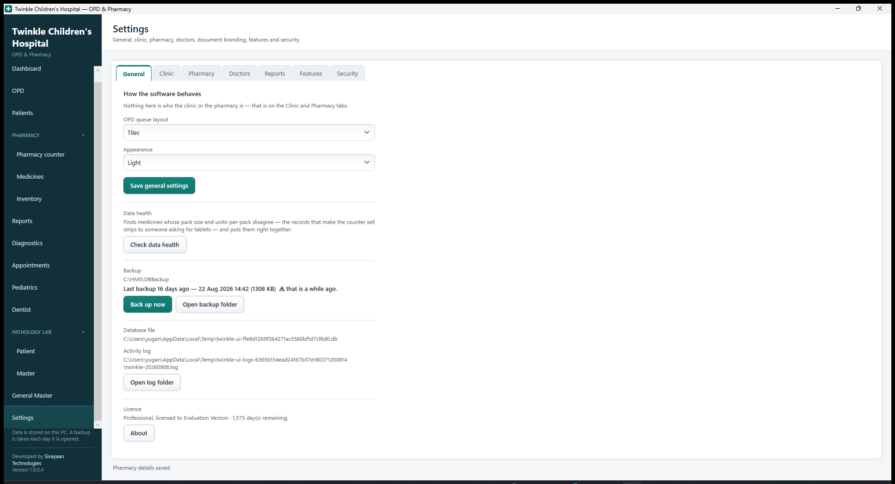

## Shop details (left card)

| Control | What to enter |
|---|---|
| **Clinic / shop name** | Printed largest, at the top of every document |
| **Address** | One line, under the name |
| **Phone** | Shown beside the address |
| **Registered for GST** | Off by default. See below — this changes what your bills are |
| **GSTIN** | Your GST number. Only enabled when registered |
| **Drug licence no** | Your 20B/21B number. **Required on a chemist's bill** |
| **Pharmacist** | Printed at the foot of the bill |
| **OPD queue layout** | `Tiles` or `Rows` — see [section 3](#choosing-tiles-or-rows) |
| **Bill footer** | Free text at the bottom of a bill, e.g. "Get well soon" |
| **Save shop details** | Applies everything above. New documents use it immediately |

Below the button it shows the **database file** and the **activity log** path, with
an **Open log folder** button. You need those only if reporting a problem.

> The application works with these blank — the GSTIN line simply does not print.
> Fill them in before you issue a real bill to a customer.

> ### Registered for GST, or not
>
> This one setting changes what your bills legally are.
>
> | | Registered **off** | Registered **on** |
> |---|---|---|
> | Bill is headed | `INVOICE` | `TAX INVOICE` |
> | GSTIN printed | no | yes |
> | GST charged | **none** | extracted from the MRP |
> | GST column and summary | hidden | shown |
>
> It is **off by default on purpose**. Issuing a document headed "tax invoice",
> with a GSTIN on it, when you are not registered is a false statement — so
> switching it on has to be a deliberate act.
>
> Turning it on later does not rewrite old bills. Each bill remembers what it was
> when it was issued, so a reprint always shows what the customer was given.

## Doctors (right card)

| Control | What it does |
|---|---|
| **List** | Every doctor. Click one to edit it |
| **Name** | Appears as an OPD tab and on the prescription |
| **Speciality** | Printed under the doctor's name on the prescription |
| **Registration no** | Printed on the prescription. Required on a real one |
| **Default consultation fee** | Fills in automatically when booking for this doctor |
| **Save doctor** | Saves the one being edited |
| **+ New doctor** | Clears the form to add another |

**At least one doctor is needed before any visit can be booked.**

---

# 3. The OPD screen

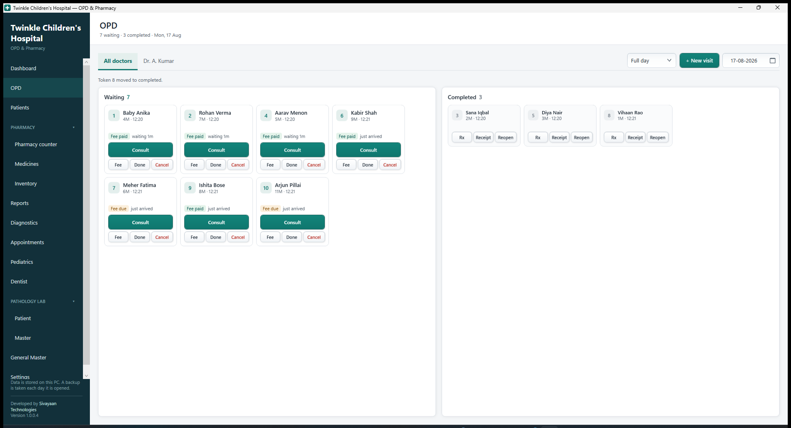

## Top row

| Control | What it does |
|---|---|
| **All doctors** tab | Shows every patient in the clinic |
| **Doctor tabs** | One per doctor. Shows only their patients |
| **+ New visit** | Opens the booking panel on the right |
| **Date** | Which day you are looking at. Defaults to today |

The doctor is a tab rather than a column on each patient, which is why the tiles
stay small.

## The two columns

**Waiting** — everyone still to be seen. **Completed** — everyone finished.

A patient moves from one to the other and can be moved back.

## What a waiting tile shows

| On the tile | Meaning |
|---|---|
| Green number | **Token number**. What you call out |
| Name | The patient |
| `4F · 08:55` | Age, sex, and the time they were booked |
| Grey line | What they came in with |
| `Fee paid` / `Fee due` | Green if the consultation fee is taken, amber if not |
| `just arrived` / `waiting 12m` | How long they have been sitting there |

## Buttons on a waiting tile

| Button | What it does |
|---|---|
| **Consult** | Opens the consultation window for this patient |
| **Fee** | Takes the consultation fee, issues a numbered receipt, offers to print it |
| **Done** | Moves the tile to Completed without a consultation |
| **Cancel** | Cancels the visit. Asks first |

## Buttons on a completed tile

| Button | What it does |
|---|---|
| **Rx** | Prints the prescription. Says so if there isn't one |
| **Receipt** | Prints the fee receipt again, marked DUPLICATE |
| **Reopen** | Moves the patient back to Waiting |

## Choosing tiles or rows

Set in Settings. Tiles are easier to read across a room; rows fit more people on
screen when the clinic is busy. **Everything works the same in either.**

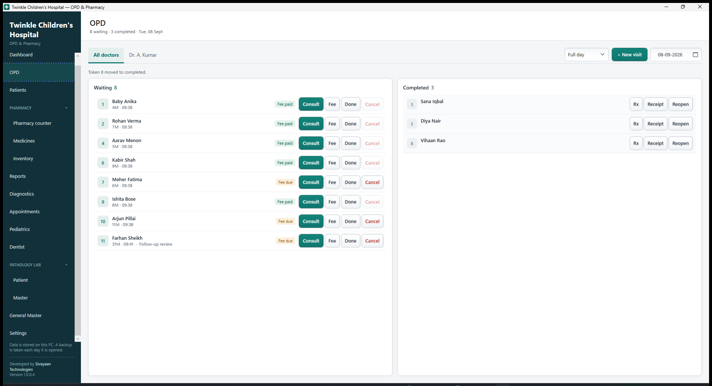

---

# 4. Booking a visit

Click **+ New visit**. The panel opens on the right, in three numbered steps.

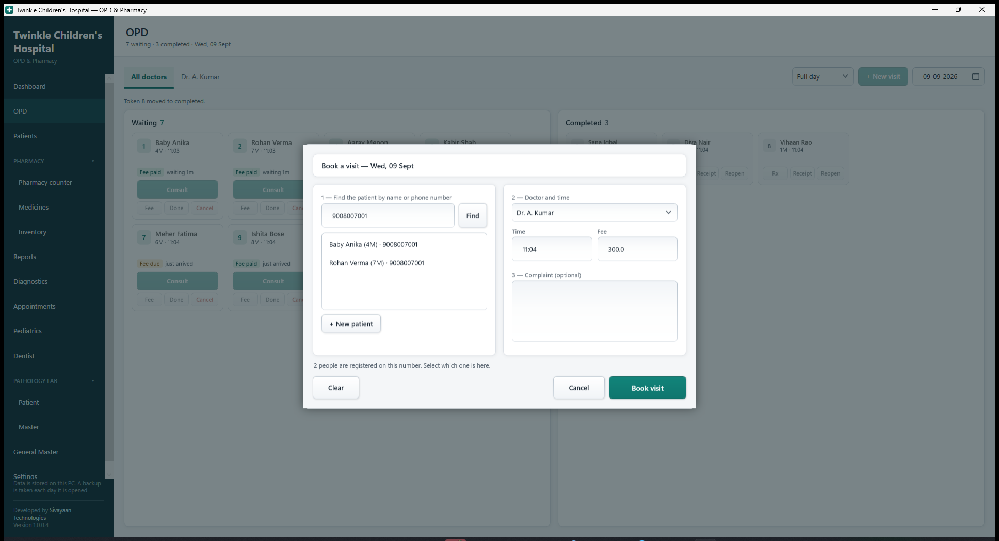

## Step 1 — find the patient

| Control | What it does |
|---|---|
| **Search box** | Type a name or a phone number. Enter also works |
| **Find** | Runs the search |
| **Results list** | Everyone matching. **Click the right one** |
| **+ New patient** | Opens the form below to register someone new |

If nobody matches, the new-patient form opens by itself with what you typed
already filled in.

| New patient field | Notes |
|---|---|
| **Name** | The only one that is required |
| **Phone** | The parent's number. Shared across siblings is normal |
| **Age** | In years |
| **Sex** | Male, Female or Other |
| **Back to search** | Returns to the list without adding anyone |

## Step 2 — doctor and time

| Control | Notes |
|---|---|
| **Doctor** | Defaults to whichever tab you were on |
| **Time** | 24-hour, e.g. `09:45`. Defaults to now |
| **Fee** | Defaults to that doctor's usual charge |

## Step 3 — complaint

Optional. Whatever you type shows on the queue tile and on the prescription.

Then **Book visit**. A token number is allocated automatically and the panel
closes. **Fee taken as** below the button sets the payment method used when you
later click **Fee** on the tile.

> ### One phone, several children
>
> A parent's number covers the whole family. Typing it lists **every child**
> registered against it, and the message says so: *"3 people are registered on
> this number. Select which one is here."*
>
> The number is matched on its digits, so `9008007001`, `+91 90080 07001` and
> `90080 07001` all find the same family.
>
> If you click **Book visit** without choosing one, the application **stops you**
> rather than quietly registering a fourth child who already exists.

---

# 5. The consultation

Click **Consult** on a tile.

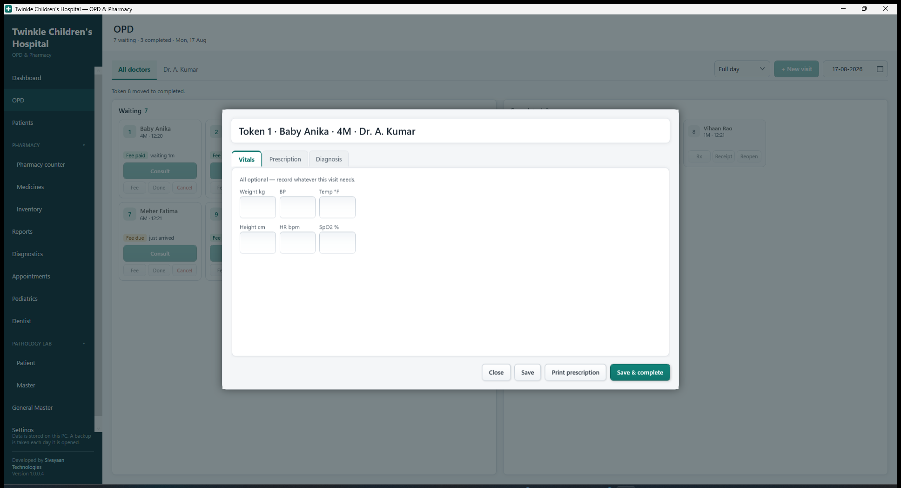

The heading shows the token, the patient, their age and sex, and the doctor.

## Left — clinical notes

| Control | Notes |
|---|---|
| **Weight kg**, **BP**, **Temp °F** | Vitals. All optional |
| **Complaint** | Carried over from booking; edit freely |
| **Diagnosis** | Printed in bold on the prescription |
| **Advice / notes** | Printed under the medicines |
| **Fee** | Can be changed here |
| **Review on** | Follow-up date. Printed as "Review on 01 Aug 2026" |

## Right — the prescription

Fill the form at the top and press **Add**. Each medicine then appears in the
list below.

| Control | Notes |
|---|---|
| **Medicine** | Type two letters or more to search our pharmacy. Matches appear underneath — click one to use it |
| **Dose** | e.g. `5 ml`, `1 tab` |
| **Morning · Afternoon · Night** | Three lists: `0`, `1/4`, `1/2`, `1`, `2`. Pick how many at each time of day |
| **Days** | Length of the course |
| | *Nothing is filled in for you — a dose is the doctor's decision, not the software's* |
| **Qty (units)** | **Individual tablets.** Worked out for you — change it if you want |
| Grey line under the fields | What the course comes to, in tablets and in strips |
| **Instructions** | e.g. "after food". Printed under the line |
| **Add** | Adds the medicine to the list |
| **✕** in the list | Removes that medicine |

The three lists replace the old typed frequency box. `1-0-1` was quick for
anyone who already knew the notation and a guess for everyone else; picking from
three lists cannot be mistyped, and the prescription still prints in the
familiar `1-0-1` form.

Frequency and days are **kept after adding**, because a prescription usually
repeats the same course — only the medicine changes.

> ### Quantity is always in individual units
>
> You pick `1`, `0`, `1` for `3` days and it fills in **6** — six tablets, not
> six strips. The line underneath shows what the pharmacy will hand over, e.g.
> *"6 units · 1 × 10 TAB minus 4"*, so there is never any doubt about whether a
> number means tablets or strips.
>
> `SOS` and `PRN` have no fixed daily dose, so nothing is filled in and you type
> the quantity yourself.

> ### Prescribing something the clinic does not stock
>
> Type the name and simply **do not pick anything from the list**. The line reads
> *"Not in our pharmacy — it will be written on the prescription only"*, and it is
> added exactly as typed. The parent buys it from an outside chemist.
>
> **It is never added to our medicine records.** A name typed on a prescription
> does not create a medicine, a batch, or a price — our catalogue only ever grows
> when stock is received.
>
> A medicine you **do** pick from the list shows *"In our pharmacy · 60 in stock"*
> and can be pulled straight onto a bill at the counter, with the quantity already
> correct. One prescription can mix the two freely.

## Bottom buttons

| Button | What it does |
|---|---|
| **Close** | Leaves the consultation. Asks first if anything is unsaved |
| **Save** | Keeps everything. Patient stays in Waiting |
| **Print prescription** | Saves, then opens the print preview |
| **Save & complete** | Saves and **moves the tile to Completed** |

The **Esc** key does the same as **Close**. While the consultation is open the
rest of the app is greyed out and waits — you cannot wander off to another
screen with a half-written prescription behind you.

---

# 6. Medicines — the catalogue

What each medicine **is**. Set up once per medicine; stock is the next screen.

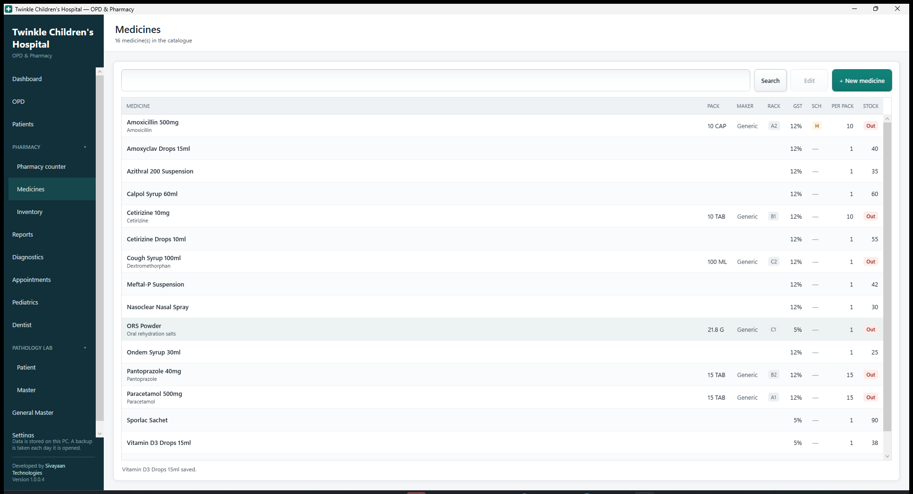

## The catalogue (left)

Search box, **Search** and **+ New medicine**. The grid shows medicine, drug,
pack, maker, rack, GST %, schedule, units per pack, and stock on hand. Click a
row to load it into the form on the right.

Search matches the **brand name**, the **drug name**, the manufacturer and the
rack. Typing `paracetamol` finds Calpol; typing `calpol` finds it too.

## Medicine details (right)

| Field | Notes |
|---|---|
| **Brand name** | What is printed on the pack — *Calpol*. The only required field |
| **Drug / generic name** | The drug itself — *Paracetamol 250mg*. Searched as well |
| **Manufacturer** | Company name |
| **Pack size** | As printed, e.g. `10 TAB`, `60ML` |
| **HSN** | Tax code. `3004` covers most formulations |
| **GST %** | Usually 5 or 12 |
| **Schedule** | `None`, `H`, `H1`, `X`. H1 sales are recorded in a register |
| **Rack** | Where it sits on the shelf. Searchable |
| **Reorder level** | Below this it appears in the Low stock report |
| **Units per pack** | **10 for a ten-tablet strip. 1 for a syrup bottle** |
| **Sell loose units** | Allows part of a strip to be sold |
| **Active** | Uncheck to hide it from the counter |
| **Save medicine** | Saves it |

> ### Units per pack is what makes loose sale work
>
> Set it to `10` for a strip of ten tablets and stock is counted in **tablets**,
> so a customer can buy five. Leave it at `1` for a syrup bottle — half a bottle
> is not a thing you can sell.

---

# 7. Inventory — what is on the shelf

Everything to do with stock: receiving it, seeing the batches, correcting a
count. Nothing here changes what a medicine *is* — that is the Medicines screen.

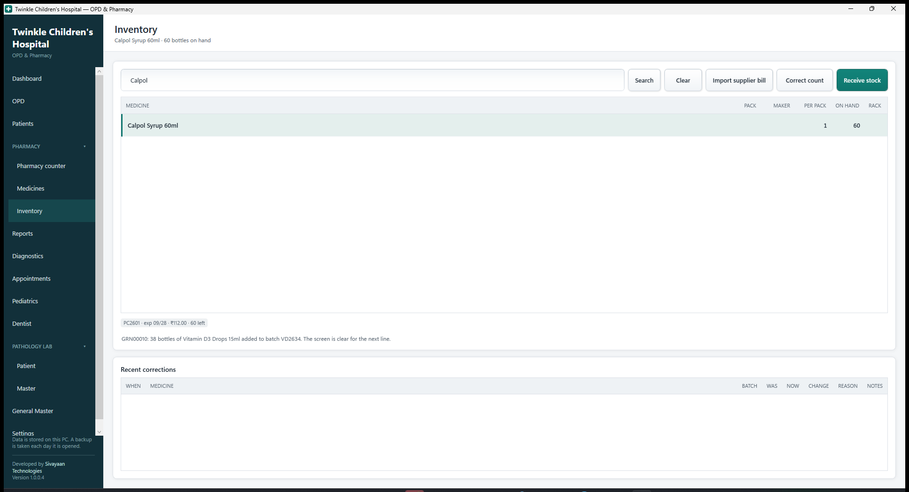

## Finding the medicine (left)

Type any part of the brand name, drug name, maker or rack and click **Search**,
then click the row. The heading at the top of the screen then names the medicine
and how much is on hand, so you always know what you are about to change.

**Import supplier bill** sits next to Search — see [section 8](#8-importing-a-supplier-bill).

## Receive stock (top right)

**This is the only way stock enters, and it always creates a batch.**

| Field | Notes |
|---|---|
| **Batch no** | Printed on the pack. **Required — it goes on the bill by law** |
| **Expiry** | The pack is good until the **end** of that month |
| **Packs** | How many **packs** arrived — strips, boxes, bottles |
| **Free** | Scheme quantity, the "+1" in 10+1. Adds to stock, costs nothing |
| **Rate** | What the hospital paid per pack |
| **MRP** | The price printed on the pack. **The counter prices from this** |
| **Supplier**, **Supplier bill no** | For your records |
| **Add stock** | Adds it |

> ### Packs in, units out
>
> Under the quantity boxes a grey line reads back what you have entered:
> *"20 pack(s) × 15 = 300 tablets onto the shelf"*. You count deliveries in
> strips, the counter sells tablets, and this is the one place the two meet —
> so it says so out loud rather than leaving you to trust it.

The form clears whenever you pick a different medicine, so a price or expiry
from the last delivery can never be carried onto the wrong batch.

**Batches on the shelf** lists every batch of the selected medicine with its
expiry, MRP and quantity left.

> **Adding stock always adds.** Receiving the same batch number again increases
> what is on the shelf. It never replaces it.

## Correct the stock count

For when the shelf and the screen disagree — breakage, a miscount, or something
keyed in wrongly.

| Control | Notes |
|---|---|
| **Batch** | Which batch is wrong. Shows expiry, MRP and current count |
| **True count** | What is **actually** on the shelf, in units |
| **Reason** | `Recount`, `Breakage`, `Expired`, `Lost`, `Entry error`, `Other` |
| **Notes** | Free text — worth writing for anything unusual |
| **Correct count** | Applies it |
| **Recent corrections** | When, what, was, now, change, reason and notes |

> ### Every correction is recorded
>
> Stock otherwise only moves by receiving or selling, and both leave a document.
> A manual correction has none, so it writes its own — otherwise a shortfall
> looks the same as theft and nobody can say what happened.
>
> The correction and its record are saved together: you cannot get one without
> the other. Setting the count to what it already is is refused, and stock cannot
> go below zero.

---

# 8. Importing a supplier bill

Instead of keying in a delivery line by line, load the file your supplier sends.
**Inventory → Import supplier bill.**

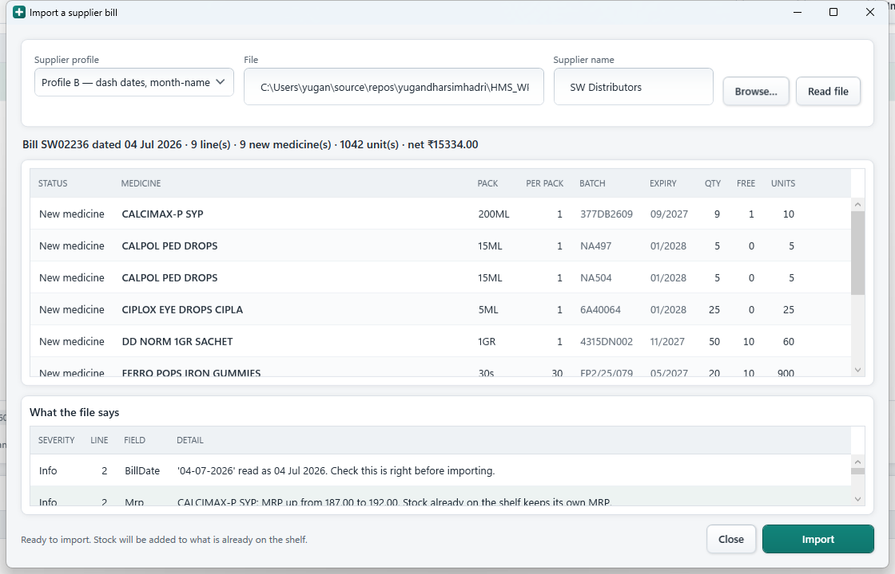

## Step 1 — choose the profile and the file

| Control | What it does |
|---|---|
| **Supplier profile** | Which supplier's format this is. Each knows that supplier's date and expiry style |
| **File** | The path. Use Browse |
| **Supplier name** | **Type this** — the file does not contain it |
| **Browse…** | Pick the file. Reads it immediately |
| **Read file** | Re-reads it after changing the profile |

## Step 2 — check what it will do

The summary line reads, for example:
*"Bill SW02236 dated 04 Jul 2026 · 9 line(s) · 9 new medicine(s) · 1042 unit(s) · net ₹15334.00"*

| Column | Meaning |
|---|---|
| **STATUS** | `Matched` — found in your catalogue · `Check` — a likely match, confirm it · `New medicine` — will be created |
| **MEDICINE**, **PACK**, **BATCH**, **EXPIRY** | As the supplier sent them |
| **PER PACK** | **Editable.** Units in one pack |
| **QTY**, **FREE** | Packs billed, and free packs |
| **UNITS** | What will land on the shelf: (qty + free) × per pack |
| **RATE**, **MRP**, **GST** | Cost, printed price, tax rate |

**What the file says** below lists everything worth knowing — the bill date it
read, MRP changes, anything it could not understand.

> ### Check the PER PACK column
>
> The file rarely states how many are in a pack. `30s` is read as 30 gummies.
> `60ML` is one bottle and stays `1` — a syrup is not sixty sellable units.
>
> For strips, **type the real number** before importing. Correct it once and the
> medicine remembers it.

## Step 3 — import

**Import** writes everything in one go. **Close** abandons it — nothing is
written until you click Import.

Afterwards it reports: *"Imported as GRN00003: 9 line(s), 9 new medicine(s), 1042
unit(s) added to stock."*

### What the import guarantees

- **Stock is added**, never replaced. 12 counted by hand plus 5 on the bill is 17
- **The same bill cannot be imported twice.** It is refused by bill number
- **Nothing is written if anything fails.** All of it, or none
- **The supplier's product codes are remembered**, so their next bill matches by itself

---

# 9. The pharmacy counter

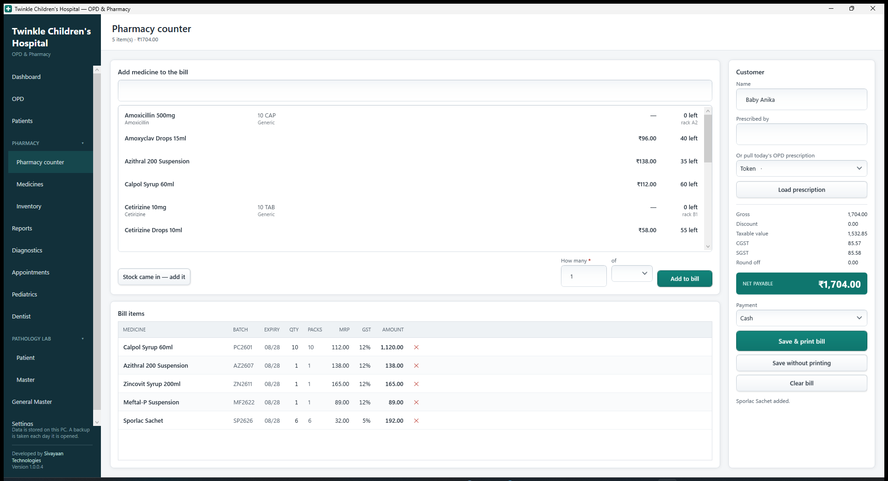

Three steps per line: **find the medicine, set the quantity, add.**

## Add medicine to the bill

| Control | What it does |
|---|---|
| **Medicine** | Type part of the name. Enter searches |
| **Find** | Runs the search |
| **Results list** | Shows pack, maker, rack and stock. Click one |
| **Batch** | **The nearest-expiry batch with stock is chosen for you** |
| **Qty (units)** | **Tablets, not strips.** `5` sells five out of a strip |
| **Disc %** | Discount on this line |
| **Add to bill** | Adds the line |

## Bill items

| Column | Notes |
|---|---|
| **MEDICINE**, **BATCH**, **EXPIRY** | What is being handed over |
| **QTY** | Base units. Editable |
| **PACKS** | Reads back as `2 × 10 TAB + 3` |
| **MRP**, **DISC %** | Editable |
| **GST %**, **AMOUNT** | Calculated |
| **✕** | Removes the line |

## Customer (right)

| Control | Notes |
|---|---|
| **Name** | Defaults to `Cash`. **A walk-in needs no patient record** |
| **Prescribed by** | Doctor's name. Required on the bill for a Schedule H1 drug |
| **Or pull today's OPD prescription** | Pick a patient seen today |
| **Load prescription** | Puts every prescribed medicine that is in stock on the bill |

## Totals

```
Gross            what the MRP comes to
Discount         anything taken off
Taxable value    the MRP with GST taken back out of it
CGST + SGST      the tax, split in half
Round off        to the nearest rupee
NET PAYABLE      what the customer hands over
```

| Control | What it does |
|---|---|
| **Payment** | Cash, UPI or Card |
| **Save & print bill** | Saves and opens the preview |
| **Save without printing** | Saves only |
| **Clear bill** | Empties the counter without saving |

> ### Every bill is settled in full
>
> There is no credit and no part payment — by design, because the clinic does not
> offer them. A bill is paid before it is saved, so nothing is ever outstanding
> and there is no balance to chase.

> ### MRP already includes GST
>
> Tax is never added on top. Ten strips at ₹112 MRP come to **exactly ₹1,120** —
> of which ₹1,000 is the taxable value and ₹120 is GST.

> ### A whole strip always costs what is printed on it
>
> Five tablets from a ₹112 strip of ten cost ₹56. But a **full** strip costs
> ₹112, not ten times the rounded per-tablet price. This matters where the price
> does not divide evenly: ₹87.50 across fifteen tablets is ₹5.83 each, and the
> full strip still costs ₹87.50.

---

# 10. Patients

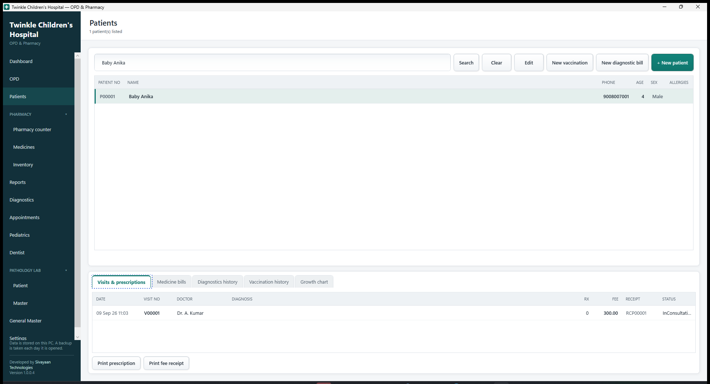

Search by **name, patient number or phone**. A phone number lists the whole
family.

## The register (top left)

Patient no, name, phone, age, sex, allergies. Click a row to select it.

## Patient details (right)

| Field | Notes |
|---|---|
| **Patient no** | Allocated on save, e.g. `P00012` |
| **Name**, **Phone**, **Age**, **Sex** | |
| **Address**, **Allergies** | Optional |
| **Save patient** | Saves changes |
| **Remove** | Refused if they have visits on record |
| **+ New patient** | Registers someone without booking a visit |

## History (bottom left)

**Visits & prescriptions** — every visit ever, with diagnosis, fee and receipt
number. Select one, then:

- **Print prescription** — prints it however long ago it was
- **Print fee receipt** — prints the receipt again, marked DUPLICATE

**Medicine bills** — every bill for this patient, with **Print bill**.

> This is where you go when someone returns weeks later having lost a receipt.

---

# 11. Reports

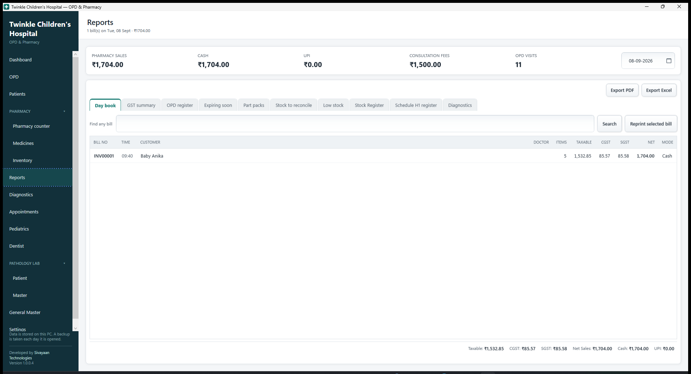

Across the top for the chosen date: pharmacy sales, cash, UPI, consultation fees
collected, and OPD visits.

| Tab | What it is for |
|---|---|
| **Day book** | Every bill for the day. **Find any bill** searches every date by bill number or customer name. **Reprint selected bill** prints it again |
| **GST summary** | Taxable value, CGST and SGST grouped by rate — what a return needs |
| **OPD register** | Every visit, diagnosis, fee, and whether it was paid |
| **Expiring soon** | Batches within 90 days of expiry. Return these to the distributor |
| **Low stock** | Anything at or below its reorder level |
| **Schedule H1 register** | Statutory record of H1 sales. **Keep for three years** |

---

# 12. Printing

Everything previews before any paper moves.

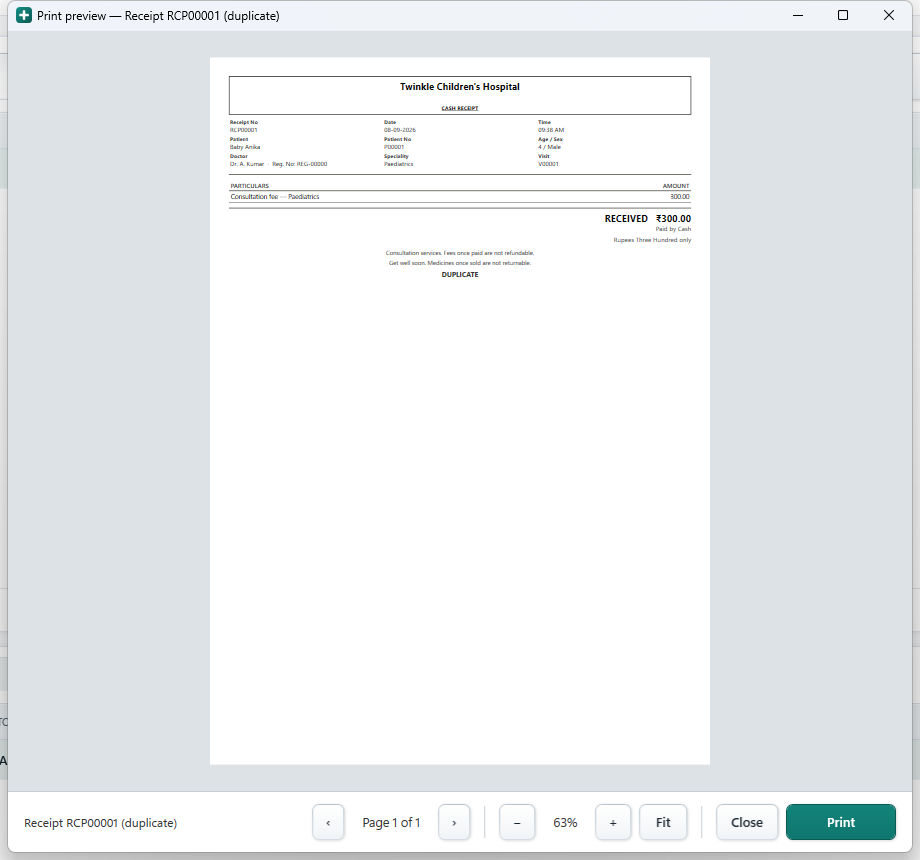

**Print** sends it. **Close** goes back. If no printer is set up the application
says so plainly instead of failing, and you can still preview.

| Document | Number | Print it from |
|---|---|---|
| Tax invoice (medicines) | `INV00001` | Counter · Reports day book · patient record |
| Consultation receipt | `RCP00001` | OPD tile · patient record |
| Prescription | `V00001` | Consultation · OPD tile · patient record |

**Anything can be reprinted at any time.** A reprint is stamped **DUPLICATE** so
it cannot be mistaken for the original.

---

# 13. When something goes wrong

## The application does not close on an error

If something unexpected happens it tells you in plain words, writes the details
to the log, and **keeps running**. A half-typed bill is not lost. You will see a
message like:

> *Taking the fee could not be completed. The change could not be saved — it may
> already exist, or a required field is missing. Nothing was changed.*

## Things it refuses on purpose

| It says | Why |
|---|---|
| "Only 3 × 10 TAB + 4 left of …" | You cannot sell stock you do not have |
| "Batch … expired on …" | Expired medicine cannot be dispensed |
| "3 people match that. Select which one" | Siblings share a phone; the wrong child is worse than a second click |
| "This patient has visits on record" | Deleting them would orphan their bills |
| "Bill … was already received on …" | Importing twice would double your stock |
| "No MRP" during import | The counter prices from MRP and cannot sell without one |
| "Batch number is required" | It has to appear on the bill by law |

## Your data

Everything is in one file: `C:\ProgramData\TwinkleHMS\twinkle.db`. Copy that file
and you have copied the clinic.

**Backups** are automatic — one per day into `C:\ProgramData\TwinkleHMS\backups`,
keeping the last 14. That protects against mistakes, **not against the PC dying**.
Copy the folder to a pen drive weekly.

**The log** is at `C:\HMS\Logs`, one file per day, 30 days kept. Settings has an
**Open log folder** button and shows the exact path. Send that day's file when
reporting a problem.

## Changing where things are kept

`appsettings.json` sits next to the application and can be edited in Notepad.
Restart the application afterwards.

```json
{
  "LogDirectory": "C:\\HMS\\Logs",
  "DatabasePath": null,
  "BackupsToKeep": 14,
  "LogDaysToKeep": 30
}
```

| Setting | Notes |
|---|---|
| `LogDirectory` | Where daily logs are written |
| `DatabasePath` | Full path to the database file. `null` uses `C:\ProgramData\TwinkleHMS\twinkle.db` |
| `BackupsToKeep` | Daily database backups kept before the oldest is deleted |
| `LogDaysToKeep` | Days of logs kept |

Use double backslashes in paths, as above.

> If the folder cannot be written to — a locked-down PC, or a network drive that
> is offline — the application does **not** fail. It falls back to
> `C:\ProgramData\TwinkleHMS\logs`, and the first line of the log says which
> folder it wanted and which it used. The same applies to a settings file with a
> typo in it: built-in defaults are used and the log says so.

## Not in this version

Sales returns and credit notes · purchase returns · inter-state IGST ·
e-invoicing · multi-terminal use · the Schedule X narcotic register.

**Credit and part payment are not missing — they are deliberately absent.** The
clinic settles every bill in full at the counter, so there is no outstanding
balance anywhere in the system and nothing to reconcile.

The GST arithmetic and the invoice layout are correct for a retail counter, but
this is not a certified e-invoicing integration. Have a CA review the GST summary
before it feeds a return, and confirm register formats with your local drug
inspector.
