# Twinkle Children's Hospital

## User guide

For the front desk, the doctor, and the pharmacy counter.

Every screenshot is taken from the running application. To refresh them all after
a change, run the one test that produces them:

```bash
dotnet test tests/Pharma.UiTests --filter ScreenshotCapture
```

---

## Contents

**Getting started**
1. [The window](#1-the-window)
2. [Settings — set this up first](#2-settings--set-this-up-first)

**The OPD desk**
3. [The OPD screen](#3-the-opd-screen)
4. [Booking a visit](#4-booking-a-visit)
5. [Taking the consultation fee](#5-taking-the-consultation-fee)
6. [The consultation](#6-the-consultation)

**The pharmacy**
7. [Medicines — the catalogue](#7-medicines--the-catalogue)
8. [Inventory — what is on the shelf](#8-inventory--what-is-on-the-shelf)
9. [Importing a supplier bill](#9-importing-a-supplier-bill)
10. [The pharmacy counter](#10-the-pharmacy-counter)

**The lab**
11. [Diagnostics](#11-diagnostics) — optional, switched on from Settings → Features

**Everything else**
12. [Patients](#12-patients)
13. [Reports](#13-reports)
14. [Printing](#14-printing)
15. [Worked examples](#15-worked-examples)
16. [What the system will and will not do](#16-what-the-system-will-and-will-not-do)
17. [When something goes wrong](#17-when-something-goes-wrong)

**[Common tasks, step by step](#common-tasks-step-by-step)** — the short version of
everything above. Start here if you just want to get through a day.

---

# Common tasks, step by step

Each task below is complete on its own. Screen-by-screen detail follows in
sections 1 to 16.

## A. Set the clinic up — once, before anything else

1. Click **Settings**.
2. **Clinic tab** — clinic name, address, phone. Tick **Registered for GST**
   only if the clinic actually is, then enter the **GSTIN**; leave it unticked
   and OPD documents print as a plain document. Click **Save Clinic details**.
3. **Pharmacy tab** — pharmacy name, address, phone, the same GST tick, the
   **drug licence number** and the **pharmacist's name**. Click **Save
   Pharmacy details**.
4. **Doctors tab** — enter the first **doctor**: name, speciality,
   registration number, usual fee. Click **Save doctor**.

You cannot book a visit until at least one doctor exists.

Switch on **Diagnostics** under the **Features** tab too, if this clinic runs
its own lab tests — see task J.

## B. Book a walk-in patient

1. Click **OPD**, then **+ New visit**. The booking form opens over the screen.
2. Type the patient's **name or phone number** and press Enter.
3. If they are listed, **click the right person**. If a whole family shares the
   phone, everyone on it appears — pick the child who is actually here.
4. If nobody matches, the new-patient form opens. Enter **name, phone, age, sex**.
5. Choose the **doctor**, adjust **time** and **fee** if needed.
6. Type the **complaint** if you want it on the tile and the prescription.
7. Click **Book visit**. A token number is allocated.

## C. Take the consultation fee

1. On the **OPD** screen, find the patient's tile in **Waiting**.
2. Click **Fee** on the tile. A small form opens over the screen.
3. Check the **token, name, age and doctor** at the top — this is the moment to
   notice you have the wrong child.
4. The **fee** is already filled in from the booking. Change it if you are taking
   something else — a follow-up at half fee, a family concession.
5. Set **Paid by** — Cash, UPI or Card.
6. For UPI or Card, optionally note the **Transaction / reference no.** — never
   required, just handy for reconciling against the gateway or bank statement.
7. Leave **Print the receipt** ticked unless you do not want paper.
8. Click **Take fee**. It asks once more, naming the amount and the child.
   Answer **Yes**.

The badge changes to **Fee paid**. Clicking Fee twice does nothing.

**Nothing is written until you answer Yes.** Cancel at any point and no receipt
number is used up. This matters because a receipt is numbered and dated the
moment it is written — a fee taken wrongly has to be reversed on paper, so the
software makes you look at it first.

## D. See a patient and write a prescription

The consultation is three tabs: **Vitals**, **Prescription**, **Diagnosis**.

1. Click **Consult** on the patient's tile.
2. **Vitals tab** — weight, BP, temperature, height, heart rate, SpO2. All optional.
3. **Prescription tab** — for each medicine:
   - Type two letters or more into **Medicine**.
   - **Click a match** to use one you stock, or keep typing for one you do not.
   - Enter the **dose**.
   - Set **Morning · Afternoon · Night** from the three lists — `0`, `1/4`,
     `1/2`, `1` or `2`. One in the morning and one at night is `1`, `0`, `1`.
   - Enter **days**.
   - **Qty is filled in for you** in individual tablets — change it if you want.
   - Click **Add**. The whole row then empties, dose and days included, ready
     for the next medicine.
4. **Diagnosis tab** — complaint, diagnosis, advice, a review date if there is
   one, and, if the **Diagnostics** module is switched on, any lab tests the
   patient needs. Search or type a test and click **Add** to put it on the
   list — this does not bill anything; it is picked up later at the
   Diagnostics desk. See [section 11](#11-diagnostics).
5. Click **Save & complete**. The tile moves to **Completed**.

The consultation covers the whole window while it is open, and the rest of the
app waits behind it. Nothing else can be started until you leave, so a
consultation cannot be opened and then forgotten. **Close** or the **Esc** key
leaves it; if anything has been typed and not saved you are asked first.

## E. Add a new medicine and put stock on the shelf

This is two jobs on two screens. **Medicines** is where a medicine is described,
once. **Inventory** is where stock arrives, every delivery.

**First, describe the medicine — Medicines screen**

1. Click **Medicines**, then **+ New medicine**. The form opens over the screen.
   To change one already there, select the row and click **Edit** — or just
   double-click it.
2. Enter the **brand name** as printed on the pack — *Calpol*.
3. Enter the **drug / generic name** — *Paracetamol 250mg*. Staff search by
   either, so filling both is worth the few seconds.
4. Enter the **manufacturer** and **pack size** as printed.
5. Set **Sold as** — tablet, capsule, bottle, sachet.
6. Set **Units in one pack** — `15` for a strip of fifteen, `1` for a bottle.
7. Set **GST %**, **schedule**, **rack** and **reorder level**.
8. Click **Save medicine**. The form closes — that is normal. The message
   underneath the catalogue confirms what was saved.

**Then, put stock on the shelf — Inventory screen**

9. Click **Inventory**, type the name in the search box and click **Search**.
10. Click the medicine in the list. The heading names it and says how much is
    on hand.
11. Click **Receive stock**. A form opens over the screen, headed with the
    medicine's name and what is already on the shelf.
12. Enter **batch no**, **expiry**, **packs**, any **free** packs, the **rate**
    you paid and the **MRP** printed on the pack.
13. Check the line that appears — *"20 pack(s) × 15 = 300 tablets onto the shelf"*.
14. Click **Add stock**. The form closes and the screen clears, ready for the
    next line of the delivery note.

If you are entering several medicines off one delivery note, repeat steps 9–14
for each.

**Everything clears between lines, the supplier and bill number included.** That
is deliberate. A supplier left in the box is a supplier silently attached to the
next delivery, and a wrong supplier on a batch is worse than a blank one — it is
wrong in the reconciliation report rather than merely missing from it.

## F. Load a supplier's file instead of typing it

1. Click **Inventory**, then **Import supplier bill**.
2. Choose the **supplier profile** that matches their format.
3. Click **Browse…** and pick the file. It is read immediately.
4. Type the **supplier name** — the file does not contain it.
5. Check the grid, especially **PER PACK**. `30s` reads as 30; `60ML` stays 1.
   **Type the real number for any strip.**
6. Read the notices underneath — bill date, MRP changes, anything unclear.
7. Click **Import**.

Stock is **added** to what is already there. The same bill cannot be imported
twice.

## G. Sell to someone who walks in

1. Click **Pharmacy counter**.
2. Type part of the medicine name. It filters as you type, in any case.
3. **Click the medicine** in the results.
4. Enter **How many**, and check the unit beside it says what you mean —
   *tablets* or *strips of 10*.
5. Click **Add to bill**. The search box empties and the medicine is let go of —
   the line is on the bill, so start the next one by typing its name.
6. Repeat 2–5 for each medicine. The bill builds up; only the search clears.
7. Leave the customer as **Guest**, or type their name.
8. Choose **Payment**. For UPI or Card, optionally note the **Transaction /
   reference no.**
9. Click **Save & print bill**.

## H. Sell part of a strip

Exactly as task G. Nine tablets out of a strip of ten is **`9`** with the unit
on **tablets** — the bill line then reads `0 × 10 TAB + 9 tablets` so you can
see what to hand over.

The price is proportional: a strip of ten at ₹120 makes each tablet ₹12, so nine
is ₹108. **A full strip always costs exactly the MRP printed on it** — the
arithmetic never drifts by a few paise.

Switch the unit to **strips of 10** and type `2` when someone wants whole
strips; it becomes 20 tablets.

> ### If the unit only offers "units"
>
> That medicine has **Units in one pack** set to 1, so the software believes one
> strip *is* one tablet — and nine tablets will be charged as nine strips.
> **Settings → Check data health** finds every medicine in that state and fixes
> them together. See task P.

## I. Dispense what a doctor prescribed

1. Click **Pharmacy counter**.
2. Under **Or pull today's OPD prescription**, choose the patient.
3. Click **Load prescription**. Everything prescribed **and in stock** is added
   with the right quantity.
4. Anything missing is named on screen — tell the parent to buy it outside.
5. Choose **Payment**, then **Save & print bill**.

## J. Bill a patient for a lab test

1. Turn the module on once, if it is not already: **Settings → Features →
   Diagnostics**, then **Save features**. A **Diagnostics** item appears in
   the sidebar immediately.
2. Click **Diagnostics**.
3. Search for the patient by **name or phone**, same as everywhere else — or,
   if the doctor already requested tests for them during today's
   consultation, skip straight to step 5.
4. Click **+ Add test**, tick every test wanted, **Done**.
5. **Or**, under **Or pull today's OPD test requests**, choose the visit and
   click **Load diagnostic tests** — this picks the patient and the tests
   together, in one click.
6. Adjust **Discount** if needed. **Referred by** only appears for a patient
   who did not come through this clinic's own OPD.
7. Choose **Payment**, then **Save & print bill**.

## K. Load the tests a doctor requested during consultation

The lab equivalent of task I.

1. **Diagnostics**, under **Or pull today's OPD test requests**.
2. Choose the visit — it only lists visits with tests requested and not yet
   billed.
3. Click **Load diagnostic tests**. Every test from that consultation is
   added, and the patient is selected automatically.
4. Choose **Payment**, then **Save & print bill**.

## L. Correct a stock count

1. Click **Inventory** and select the medicine.
2. Click **Correct count**. A form opens over the screen.
3. Choose the **batch**. If there is only one it is already chosen.
4. Enter the **true count** — what is actually on the shelf, in units. It starts
   at what the system currently believes, so you are changing a number rather
   than typing one from nothing.
5. Choose a **reason**: recount, breakage, expired, lost, entry error.
6. Add a **note** if it is unusual.
7. Click **Correct count**.

Every correction is recorded in **Recent corrections** at the foot of the
Inventory screen, with was, now and why.

If the medicine has nothing on the shelf, it says so rather than opening an
empty form — there is no count to put right.

The form closes afterwards and takes the batch with it. Correcting a second
batch means opening it again — which is the point: a correction made against a
batch you had forgotten was still selected writes off the wrong stock, and the
trail then says you meant to.

## M. Print something again, however long ago

1. Click **Patients** and search by name or phone.
2. Select the patient.
3. **Visits & prescriptions** tab → select the visit → **Print prescription** or
   **Print fee receipt**.
4. **Medicine bills** tab → select the bill → **Print bill**.

For a walk-in with no patient record: **Reports → Day book → Find any bill**,
search the bill number or customer name across all dates, then **Reprint**.

## N. Close the day

1. Click **Reports**.
2. Check the totals along the top — pharmacy sales, cash, UPI, fees collected.
3. **Day book** — every bill of the day.
4. **GST summary** — only if registered.
5. **Expiring soon** — return these to the distributor.
6. **Low stock** — what to order.
7. **Stock to reconcile** — anything added at the counter without a supplier
   bill. Match each to the bill when it arrives.
8. **Schedule H1 register** — keep for three years.

## O. Sell something the system says you do not have

1. At the **Pharmacy counter**, find the medicine and click it.
2. Click **Stock came in — add it**.
3. Enter **packs on the shelf** and the **MRP**. Everything else is optional.
4. Click **Add to shelf** and carry on with the bill.

It appears under **Reports → Stock to reconcile** until you match it to the
supplier bill.

## P. Put the medicine records right

Do this **once**, before you rely on the counter. It is the difference between
nine tablets costing ₹108 and costing ₹1,080.

1. Click **Settings**, then **Check data health**.
2. Read the list. Each row says what is wrong, what it will become, and what
   happens to the stock figure.
3. Leave the ticks as they are and click **Put the ticked ones right**.

| What it finds | What it means |
|---|---|
| **Pack size disagrees** | The pack says 15 but the medicine says 1 per pack, so the counter sells whole strips to anyone asking for tablets. Fixing it re-counts 59 strips as 885 tablets — the same packs on the shelf |
| **Old stock at a different pack size** | Stock received before the medicine was corrected. Re-counted to match |
| **Sold-as not set** | Quantities read "units" instead of tablets. Taken from what is printed on the pack |
| **Duplicate — fix by hand** | The same medicine twice. Press **Merge…** on the row |

Every re-count writes a line in **Inventory → Recent corrections**, so nothing
changes quietly.

> ### Before you tick a re-count, check one thing
>
> *"59 → 885"* is right **only if the 59 means 59 strips**. If it means 59 loose
> tablets, untick that row — it would multiply your stock by fifteen.

## Q. Merge a medicine that appears twice

1. **Settings → Check data health**.
2. Find the row marked **Duplicate** and click **Merge…**.
3. Confirm.

Its batches, purchases, sales and prescriptions all move to the record holding
the most stock, and the empty one is retired. Nothing is deleted.

You will not be able to create a new duplicate — the same brand, maker and pack
is refused, and you are offered the existing one instead.

---

# 1. The window

Screens down the left. The one you are on is highlighted. **Dashboard** is
what opens first.

| Button | What it is for |
|---|---|
| **Dashboard** | Today at a glance — see below |
| **OPD** | The day's queue. Book visits, take fees, open consultations |
| **Patients** | Everyone ever registered, with their whole history |
| **Pharmacy counter** | Selling medicines |
| **Medicines** | The catalogue — what each medicine *is*. Set up once |
| **Inventory** | Stock — what is on the shelf. Receiving, batches, corrections |
| **Reports** | End of day, GST, expiry, low stock |
| **Diagnostics** | Lab test billing. Only shown once switched on — [section 11](#11-diagnostics) |
| **Settings** | Clinic details, doctors, screen layout, optional modules |

## The Dashboard

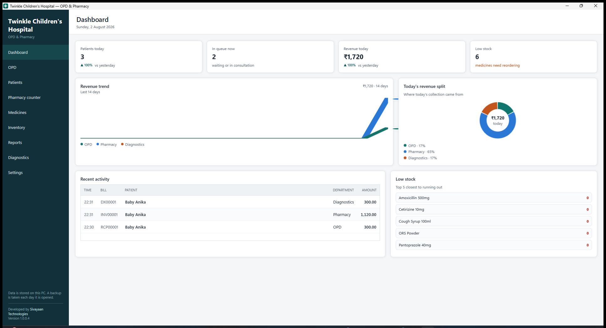

The landing screen — a five-second read of how the day is going, not another
place to do work. Every figure on it already has a real screen behind it for
the detail.

| Card | Shows |
|---|---|
| The four tiles | Patients today, how many are in queue right now, revenue today, and medicines running low — each against yesterday where that means anything |
| **Revenue trend** | One line per department — OPD, Pharmacy, Diagnostics — over the last 14 days, all three drawn to the same scale so they are honestly comparable |
| **Today's revenue split** | The same three departments, as a proportion of today's collection |
| **Recent activity** | The day's OPD fees, pharmacy bills and diagnostic bills, newest first |
| **Low stock** | The five medicines closest to running out |

The Diagnostics line, slice and legend entry only appear once that module is
switched on.

**Medicines and Inventory are deliberately separate.** Describing a medicine is
a one-off job usually done by whoever sets the shop up; receiving stock happens
every delivery and is done at the counter. Keeping them apart means neither
screen is crowded with the other's fields.

The application opens **maximised**, filling the screen. The screens it runs on
are small, and every pixel spent on desktop around the edge is a pixel not spent
on the queue.

## Forms open over the screen

Anything you fill in opens **over** the screen you were on, greyed out behind it,
and the rest of the app waits until you are done:

- Booking a visit, and taking the fee
- Adding or editing a patient
- Adding or editing a medicine
- Receiving stock, and correcting a count
- The consultation, importing a supplier bill, a print preview

This is on purpose, and it is worth knowing why. These used to be columns down
the right-hand side of each screen, permanently there and never empty. On a
small screen that meant scrolling to reach the Save button — and a form you
scroll to save is one people abandon half-filled. Worse, a column that is never
empty always has *something* in it from the last time, which is how a patient
gets saved on top of another one.

A form over the screen is opened for one job and taken away when that job is
done. **Cancel**, or the **Esc** key, closes it and writes nothing.

That is also why the lists behind them now have the whole window: the catalogue,
the register and the stock list are no longer sharing it with a form.

The heading of every screen shows the screen name and a one-line summary
underneath — for example *"2 waiting · 1 completed · Sun, 26 Jul"*.

At the bottom left it reminds you where the data lives and that a backup is taken
each day the application is opened. Under that is who built the software and
which version you are running:

> Developed by Sivayaan Technologies
> Version 1.0.0.4

Read that version number out if you ever ring for help — it says which build of
the software you have, which is the first thing anyone helping you needs to
know. It is on screen whatever page you are on, so nobody has to go looking
for it.

## Screens clear themselves when the job is done

Whenever you finish something — save a patient, save a medicine, add a line to
a bill, put stock on the shelf — the screen empties itself, **including the
search box**, and the message underneath tells you what was saved.

This is deliberate and it matters. A form that still holds the last record is
not ready for the next one: typing the next patient's name into it and pressing
Save would change the person you just entered instead of adding anybody. The
same at the counter — the medicine you just billed would still be selected, and
pressing Add again would re-do the line you already have.

So after every save you start from a clean screen. If you want to look at what
you just saved, search for it again; it is there.

For the forms that open over the screen, "clear" means the form has **gone**,
taking everything typed into it. There is nothing left behind to be saved by
accident, because the next one gets a fresh form.

**Nothing carries over between deliveries either** — not the supplier, not the
bill number. Those two used to stay, on the reasoning that one delivery note
covers many medicines. In use that was the wrong trade: a supplier left in the
box is a supplier silently attached to the next delivery, and a wrong supplier on
a batch is worse than a blank one.

---

# 2. Settings — set this up first

Everything here prints on your bills, receipts and prescriptions. Six tabs:
**General**, **Clinic**, **Pharmacy**, **Doctors**, **Reports**, **Features**.


## General

Not who the clinic or pharmacy is — that is the Clinic and Pharmacy tabs. This
tab is how the software behaves, plus housekeeping.

| Control | What it does |
|---|---|
| **OPD queue layout** | `Tiles` or `Rows` — see [section 3](#choosing-tiles-or-rows) |
| **Appearance** | `Light` or `Dark`. Changes immediately; **Save general settings** makes it stick for next time |
| **Check data health** | Finds medicines whose pack size and units-per-pack disagree, and puts them right — see task P |
| **Back up now** | An extra backup beyond the automatic daily one. Shows where backups are kept and when the last one ran |
| **Database file**, **Activity log** | Exact paths, with an **Open log folder** button. You need these only when reporting a problem |
| **Licence** | What you are licensed for, and how long is left on it |

Printed bills, receipts and prescriptions are always black on white whatever
you choose for Appearance. Paper is paper.

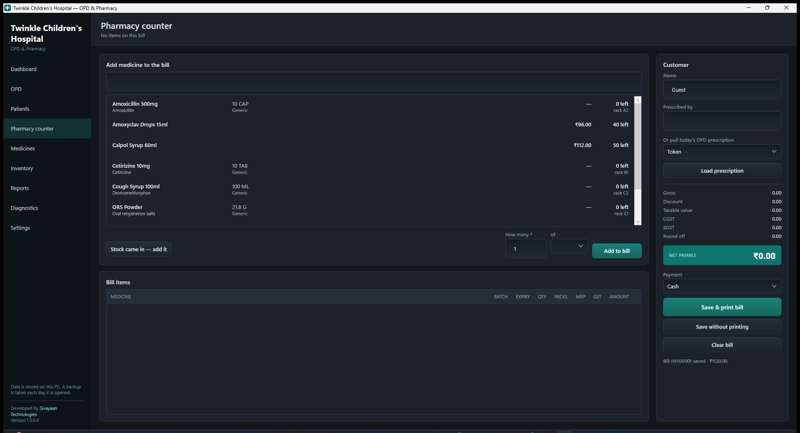

## Clinic

Everything printed on an OPD prescription and fee receipt.

| Control | What to enter |
|---|---|
| **Clinic name** | Printed largest, at the top of every OPD document |
| **Address line 1 / 2**, **Phone** | Under the name |
| **Registered for GST** | Off by default — see below |
| **GSTIN** | Only enabled when registered |
| **Consulting hours** | When the doctor sits, morning and evening. See below |
| **Footer / disclaimer** | Free text at the bottom of a prescription, e.g. "Get well soon" |
| **Save Clinic details** | New documents use it immediately |

### Consulting hours

Most clinics run two sittings with the afternoon off. Set the hours here and the
OPD screen can show one sitting at a time:

```
Morning   10:00  to  13:00
Evening   16:00  to  20:00
```

Use the 24-hour clock. The line underneath reads the four boxes back as a
sentence, so a typo is caught before it is saved rather than the next time
somebody wonders where the queue went. The end of a sitting is **exclusive** — a
morning ending at 13:00 does not also claim the one o'clock patient.

These are only a filter on the OPD screen. Nothing stops you booking a visit
outside them, and a visit booked outside both sittings still shows on **Full
day** — see [section 3](#3-the-opd-screen).

> The application works with these blank — the GSTIN line simply does not print.
> Fill them in before you issue a real bill to a customer.

> ### Registered for GST, or not
>
> This one setting changes what your bills legally are.
>
> | | Registered **off** | Registered **on** |
> |---|---|---|
> | Bill is headed | `INVOICE` | `TAX INVOICE` |
> | GSTIN printed | no | yes |
> | GST charged | **none** | extracted from the MRP |
> | GST column and summary | hidden | shown |
>
> It is **off by default on purpose**. Issuing a document headed "tax invoice",
> with a GSTIN on it, when you are not registered is a false statement — so
> switching it on has to be a deliberate act.
>
> Turning it on later does not rewrite old bills. Each bill remembers what it was
> when it was issued, so a reprint always shows what the customer was given.

## Pharmacy

Everything printed on a medicine bill.

| Control | What to enter |
|---|---|
| **Pharmacy name** | Printed largest, at the top of every pharmacy bill |
| **Address line 1 / 2**, **Phone** | Under the name |
| **Registered for GST** | Off by default — same rule as the Clinic tab, see above |
| **GSTIN** | Only enabled when registered |
| **Drug licence no** | Your 20B/21B number. **Required on a chemist's bill** |
| **Pharmacist** | Printed at the foot of the bill |
| **Footer / disclaimer** | Free text at the bottom of a bill |
| **Save Pharmacy details** | New bills use it immediately |

## Doctors

| Control | What it does |
|---|---|
| **List** | Every doctor. Click one to edit it |
| **Name** | Appears as an OPD tab and on the prescription |
| **Speciality** | Printed under the doctor's name on the prescription |
| **Registration no** | Printed on the prescription. Required on a real one |
| **Phone (optional)** | Not printed |
| **Default consultation fee** | Fills in automatically when booking for this doctor |
| **Save doctor** | Saves the one being edited, then clears the form |
| **Clear** | Empties the form. Saved doctors are unchanged |
| **+ New doctor** | Clears the form to add another |

**At least one doctor is needed before any visit can be booked.**

## Reports — document branding

Despite the name, this tab is about how documents look, not the Reports
screen. It is the shared branding behind every prescription, receipt and
bill.

| Control | What it does |
|---|---|
| **Logo** | Printed at the left of the header, beside the clinic or pharmacy name. PNG or JPEG, under 1 MB, wide rather than square works best. No logo prints the name centred in text only |
| **Upload logo** / **Remove logo** | |
| **Bottom message** | Printed at the foot of every document — a returns policy, a thank-you |
| **Save document branding** | |

## Features

Optional modules — off by default, and off means gone from the sidebar and
everywhere else, not just hidden.

| Control | What it does |
|---|---|
| **Diagnostics — lab test billing** | Adds **Diagnostics** to the sidebar: a test master and diagnostic billing, for clinics that run their own lab tests — [section 11](#11-diagnostics) |
| **Save features** | Applies immediately. The nav button appears or disappears without a restart |

---

# 3. The OPD screen


## Top row

| Control | What it does |
|---|---|
| **All doctors** tab | Shows every patient in the clinic |
| **Doctor tabs** | One per doctor. Shows only their patients |
| **Sitting** | `Full day`, `Morning` or `Evening`. See below |
| **+ New visit** | Opens the booking form over the screen |
| **Date** | Which day you are looking at. Defaults to today |

The doctor is a tab rather than a column on each patient, which is why the tiles
stay small.

## Morning, evening or the full day

Doctors sit mornings and evenings with the afternoon off, so *"who is left this
evening"* is usually the real question. The picker narrows both columns to one
sitting; the hours come from **Settings → Consulting hours**.

The heading then names the sitting and its hours:

> 3 waiting · 1 completed · Fri, 31 Jul · **Morning sitting, 10:00 to 13:00**

**It tells you when it is hiding somebody.** A visit booked at two in the
afternoon belongs to neither sitting, so on **Evening** the heading reads:

> 0 waiting · 0 completed · Fri, 31 Jul · Evening sitting, 16:00 to 20:00 ·
> **1 more today outside these hours**

Switch to **Full day** and everybody is there. Full day is how the screen starts,
and it hides nobody — so if a patient seems to have vanished, that is the first
thing to check.

## The two columns

**Waiting** — everyone still to be seen. **Completed** — everyone finished.

A patient moves from one to the other and can be moved back.

## What a waiting tile shows

| On the tile | Meaning |
|---|---|
| Green number | **Token number**. What you call out |
| Name | The patient |
| `4F · 08:55` | Age, sex, and the time they were booked |
| Grey line | What they came in with |
| `Fee paid` / `Fee due` | Green if the consultation fee is taken, amber if not |
| `just arrived` / `waiting 12m` | How long they have been sitting there |

## Buttons on a waiting tile

| Button | What it does |
|---|---|
| **Consult** | Opens the consultation window for this patient |
| **Fee** | Opens the fee form — see [section 5](#5-taking-the-consultation-fee) |
| **Done** | Moves the tile to Completed without a consultation |
| **Cancel** | Cancels the visit. Asks first |

## Buttons on a completed tile

| Button | What it does |
|---|---|
| **Rx** | Prints the prescription. Says so if there isn't one |
| **Receipt** | Prints the fee receipt again, marked DUPLICATE |
| **Reopen** | Moves the patient back to Waiting |

## Choosing tiles or rows

Set in Settings. Tiles are easier to read across a room; rows fit more people on
screen when the clinic is busy. **Everything works the same in either.**


---

# 4. Booking a visit

Click **+ New visit**. The form opens over the screen, in three numbered steps —
who is here on the left, when and why on the right.


Every control, ringed and explained:

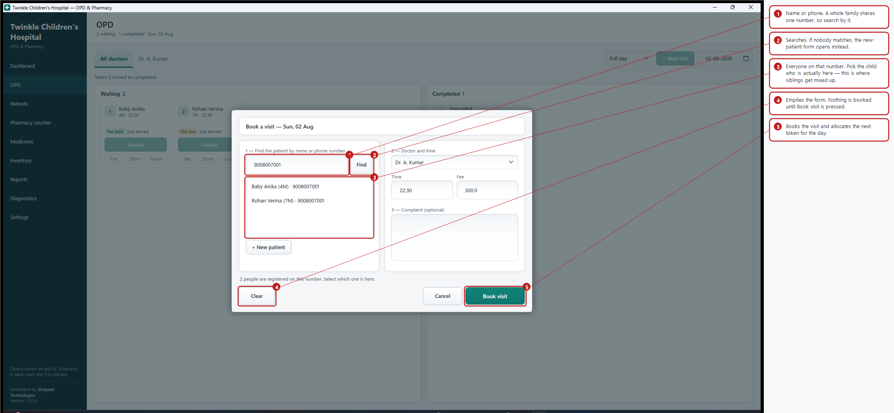

## Step 1 — find the patient

| Control | What it does |
|---|---|
| **Search box** | Type a name or a phone number. Enter also works |
| **Find** | Runs the search |
| **Results list** | Everyone matching. **Click the right one** |
| **+ New patient** | Opens the form below to register someone new |

If nobody matches, the new-patient form opens by itself with what you typed
already filled in.

| New patient field | Notes |
|---|---|
| **Name** | The only one that is required |
| **Phone** | The parent's number. Shared across siblings is normal |
| **Age** | In years |
| **Sex** | Male, Female or Other |
| **Back to search** | Returns to the list without adding anyone |

## Step 2 — doctor and time

| Control | Notes |
|---|---|
| **Doctor** | Defaults to whichever tab you were on |
| **Time** | 24-hour, e.g. `09:45`. Defaults to now |
| **Fee** | Defaults to that doctor's usual charge |

## Step 3 — complaint

Optional. Whatever you type shows on the queue tile and on the prescription.

Then **Book visit**. A token number is allocated automatically and the form
closes. **Clear** empties the form without closing it; **Cancel** closes it and
books nothing.

The payment method is no longer chosen here — it is asked for when you actually
take the money, in [section 5](#5-taking-the-consultation-fee).

> ### One phone, several children
>
> A parent's number covers the whole family. Typing it lists **every child**
> registered against it, and the message says so: *"3 people are registered on
> this number. Select which one is here."*
>
> The number is matched on its digits, so `9008007001`, `+91 90080 07001` and
> `90080 07001` all find the same family.
>
> If you click **Book visit** without choosing one, the application **stops you**
> rather than quietly registering a fourth child who already exists.

---

# 5. Taking the consultation fee

Click **Fee** on a waiting tile. A small form opens over the screen.

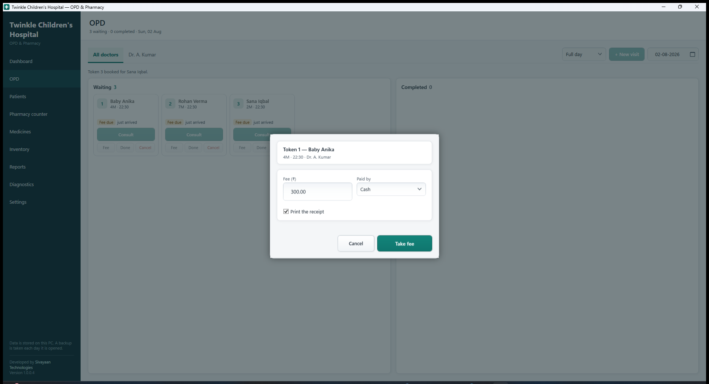

Every control, ringed and explained:

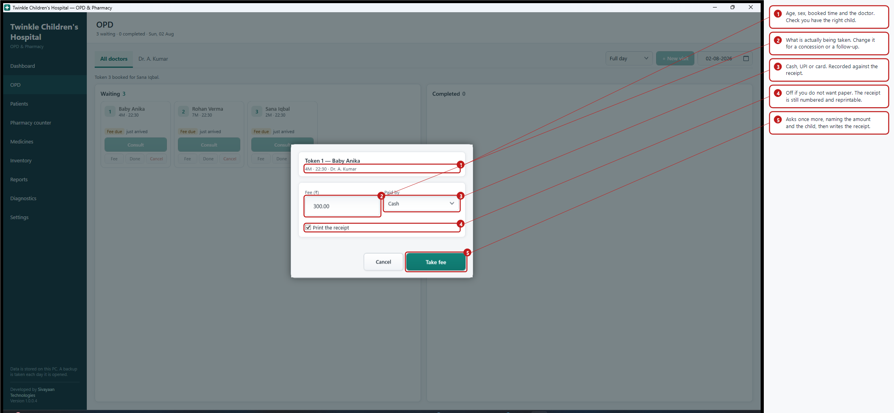

| Control | What it does |
|---|---|
| **Heading** | Token number and the patient's name |
| Line underneath | Age, sex, the booked time and the doctor |
| **Fee (₹)** | What you are actually taking. Filled in from the booking |
| **Paid by** | Cash, UPI or Card. Recorded against the receipt |
| **Print the receipt** | On by default. Turn it off if you do not want paper |
| **Cancel** | Closes it. Nothing is taken and no receipt number is used |
| **Take fee** | Asks once more, then writes the receipt |

## Changing the amount

The fee starts at whatever was quoted when the visit was booked. Change it for a
follow-up seen at half price, a family concession, or a rounding down. A note
appears the moment it differs:

> Booked at ₹300.00. This receipt will say ₹150.00.

That note is there because a concession is a decision and a mistyped digit is
not, and on screen the two look identical.

## The confirmation

**Take fee** does not take the fee. It asks:

> Take ₹300.00 from Baby Anika by Cash?

Only **Yes** writes anything. This is the last gate before a receipt number is
burnt, and it names the three things that get mixed up when two people are at the
desk at once — the amount, the method and the child.

Afterwards the badge on the tile turns green to **Fee paid**, and the message
under the doctor tabs gives the receipt number. Pressing **Fee** again does
nothing; use **Receipt** on the completed tile, or the patient's own record, to
print it a second time.

> **Why it asks at all.** A receipt is numbered and dated the moment it is
> written. There is no way to un-write one — a fee taken wrongly has to be
> reversed on paper. Pressing Fee used to take the money immediately, at whatever
> payment method a box at the top of the screen had been left on, and go straight
> to a print preview. Now nothing happens until you have seen the amount, the
> method and the name.

---

# 6. The consultation

Click **Consult** on a tile. Three tabs: **Vitals**, **Prescription**,
**Diagnosis**.


The heading shows the token, the patient, their age and sex, and the doctor.

## Vitals

| Field | Notes |
|---|---|
| **Weight kg**, **BP**, **Temp °F** | |
| **Height cm**, **HR bpm**, **SpO2 %** | |

All six are optional. Record whatever this visit needs.

## Prescription

Every control, ringed and explained:

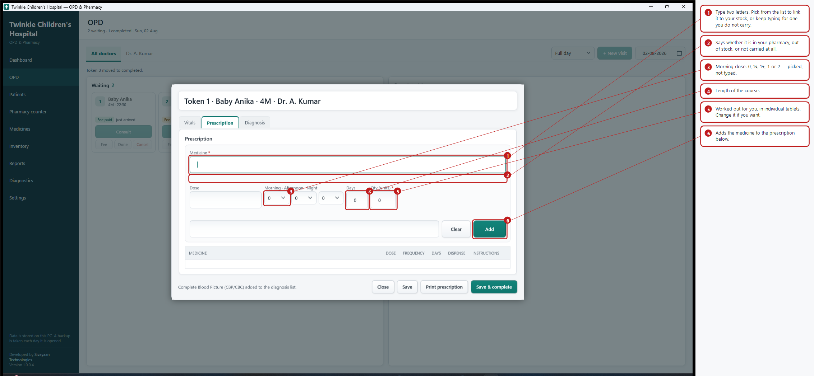

Fill the form at the top and press **Add**. Each medicine then appears in the
list below.

| Control | Notes |
|---|---|
| **Medicine** | Type two letters or more to search our pharmacy. Matches appear underneath — click one to use it |
| **Dose** | e.g. `5 ml`, `1 tab` |
| **Morning · Afternoon · Night** | Three lists: `0`, `1/4`, `1/2`, `1`, `2`. Pick how many at each time of day |
| **Days** | Length of the course |
| | *Nothing is filled in for you — a dose is the doctor's decision, not the software's* |
| **Qty (units)** | **Individual tablets.** Worked out for you — change it if you want |
| Grey line under the fields | What the course comes to, in tablets and in strips |
| **Instructions** | e.g. "after food". Printed under the line |
| **Add** | Adds the medicine to the list |
| **✕** in the list | Removes that medicine |

The three lists replace the old typed frequency box. `1-0-1` was quick for
anyone who already knew the notation and a guess for everyone else; picking from
three lists cannot be mistyped, and the prescription still prints in the
familiar `1-0-1` form.

**Add empties the whole row — dose, frequency, days and quantity included —**
not just the medicine name. A dose left behind from the last medicine would
read as chosen for this one, and a wrong dose nobody typed is worse than
retyping a right one.

> ### Quantity is always in individual units
>
> You pick `1`, `0`, `1` for `3` days and it fills in **6** — six tablets, not
> six strips. The line underneath shows what the pharmacy will hand over, e.g.
> *"6 units · 1 × 10 TAB minus 4"*, so there is never any doubt about whether a
> number means tablets or strips.
>
> `SOS` and `PRN` have no fixed daily dose, so nothing is filled in and you type
> the quantity yourself.

> ### Prescribing something the clinic does not stock
>
> Type the name and simply **do not pick anything from the list**. The line reads
> *"Not in our pharmacy — it will be written on the prescription only"*, and it is
> added exactly as typed. The parent buys it from an outside chemist.
>
> **It is never added to our medicine records.** A name typed on a prescription
> does not create a medicine, a batch, or a price — our catalogue only ever grows
> when stock is received.
>
> A medicine you **do** pick from the list shows *"In our pharmacy · 60 in stock"*
> and can be pulled straight onto a bill at the counter, with the quantity already
> correct. One prescription can mix the two freely.

## Diagnosis

Every control, ringed and explained:

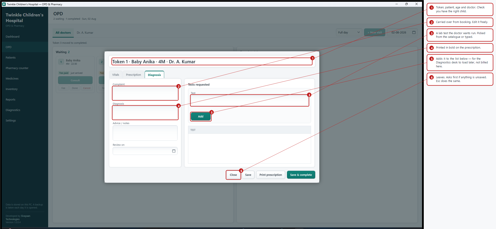

| Field | Notes |
|---|---|
| **Complaint** | Carried over from booking; edit freely |
| **Diagnosis** | Printed in bold on the prescription |
| **Advice / notes** | Printed under the medicines |
| **Review on** | Follow-up date. Printed as "Review on 01 Aug 2026" |
| **Tests requested** | Only shown once the **Diagnostics** module is switched on — [section 11](#11-diagnostics) |

**Tests requested** works like the prescription: type two letters to search the
test catalogue, click a match or keep typing for one not in it, and click
**Add**. Nothing is billed here — the list is picked up later at the
Diagnostics desk with **Load diagnostic tests**, the same way a prescription
is picked up at the pharmacy counter.

Fee is no longer set here — it is taken from the tile's own **Fee** button,
[section 5](#5-taking-the-consultation-fee).

## Bottom buttons

| Button | What it does |
|---|---|
| **Close** | Leaves the consultation. Asks first if anything is unsaved |
| **Save** | Keeps everything. Patient stays in Waiting |
| **Print prescription** | Saves, then opens the print preview |
| **Save & complete** | Saves and **moves the tile to Completed** |

The **Esc** key does the same as **Close**. While the consultation is open the
rest of the app is greyed out and waits — you cannot wander off to another
screen with a half-written prescription behind you.

---

# 7. Medicines — the catalogue

What each medicine **is**. Set up once per medicine; stock is the next screen.


## The catalogue

The grid has the whole window: medicine, pack, maker, rack, GST %, schedule,
units per pack and stock on hand. Above it sit the search box, **Search**,
**Edit** and **+ New medicine**.

Search matches the **brand name**, the **drug name**, the manufacturer and the
rack. Typing `paracetamol` finds Calpol; typing `calpol` finds it too.

To change a medicine, select the row and click **Edit** — or just **double-click
the row**, which does the same thing.

## The medicine form

Opens over the screen, in three columns: what it is called, what a pack is, and
what it costs and where it lives.

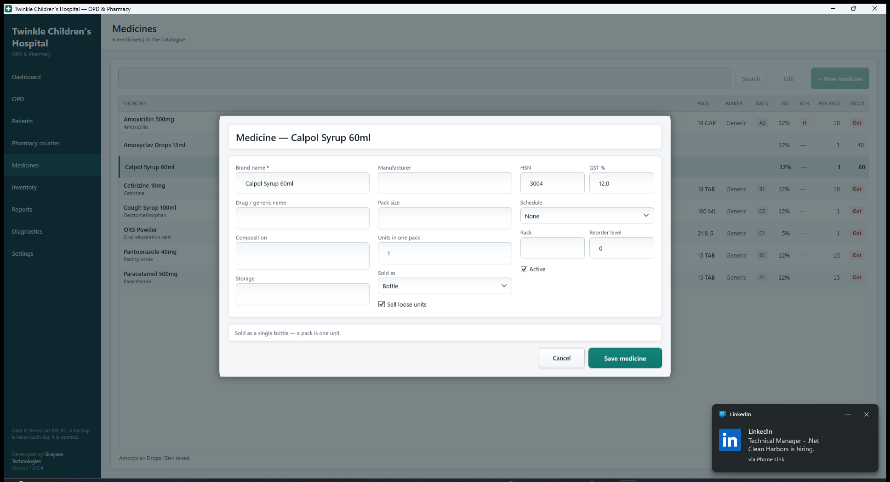

| Field | Notes |
|---|---|
| **Brand name** | What is printed on the pack — *Calpol*. The only required field |
| **Drug / generic name** | The drug itself — *Paracetamol 250mg*. Searched as well |
| **Manufacturer** | Company name |
| **Pack size** | As printed, e.g. `10 TAB`, `60ML` |
| **HSN** | Tax code. `3004` covers most formulations |
| **GST %** | Usually 5 or 12 |
| **Schedule** | `None`, `H`, `H1`, `X`. H1 sales are recorded in a register |
| **Rack** | Where it sits on the shelf. Searchable |
| **Reorder level** | Below this it appears in the Low stock report |
| **Units per pack** | **10 for a ten-tablet strip. 1 for a syrup bottle** |
| **Sell loose units** | Ticked, part of a strip can be sold. Unticked, the counter insists on whole packs |
| **Active** | Uncheck to hide it from the counter |
| **Save medicine** | Saves it and closes the form. The catalogue clears — search box included — for the next medicine |
| **Cancel** | Closes without saving. Nothing already saved is changed |

There is no Clear button, because there is nothing to clear: the form holds one
medicine and Cancel takes it away. The next one gets a fresh form.

> ### Units per pack is what makes loose sale work
>
> Set it to `10` for a strip of ten tablets and stock is counted in **tablets**,
> so a customer can buy five. Leave it at `1` for a syrup bottle — half a bottle
> is not a thing you can sell.

---

# 8. Inventory — what is on the shelf

Everything to do with stock: receiving it, seeing the batches, correcting a
count. Nothing here changes what a medicine *is* — that is the Medicines screen.


Every control, ringed and explained:

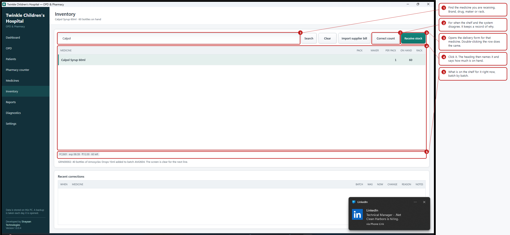

## Finding the medicine

Type any part of the brand name, drug name, maker or rack and click **Search**,
then click the row. The heading at the top of the screen then names the medicine
and how much is on hand, so you always know what you are about to change.

Underneath the grid, **the batches on the shelf** for the selected medicine
appear as small chips — batch number, expiry, MRP and how much is left.

Along the top: **Search**, **Clear**, **Import supplier bill**
(see [section 9](#9-importing-a-supplier-bill)), **Correct count** and
**Receive stock**. The last two need a medicine selected first.

At the foot of the screen, **Recent corrections** lists every count that has been
put right — when, what, was, now, the change, the reason and any note.

## Receive stock

Select the medicine, then click **Receive stock**. A form opens over the screen,
headed with the medicine's name and what is already on the shelf.

**This is the only way stock enters, and it always creates a batch.**

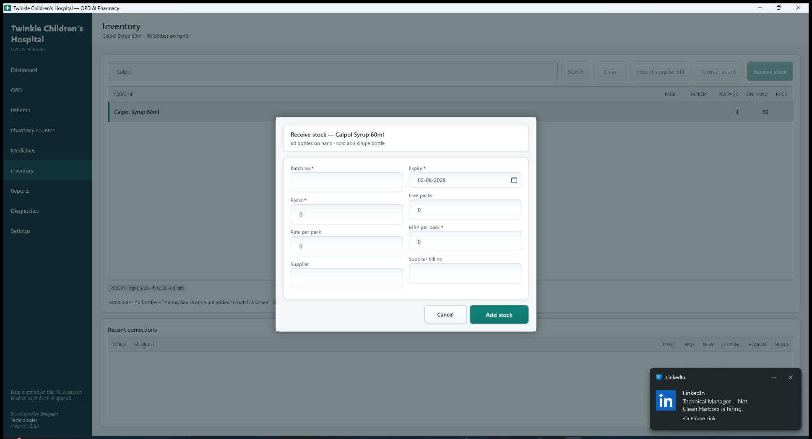

Every control, ringed and explained:

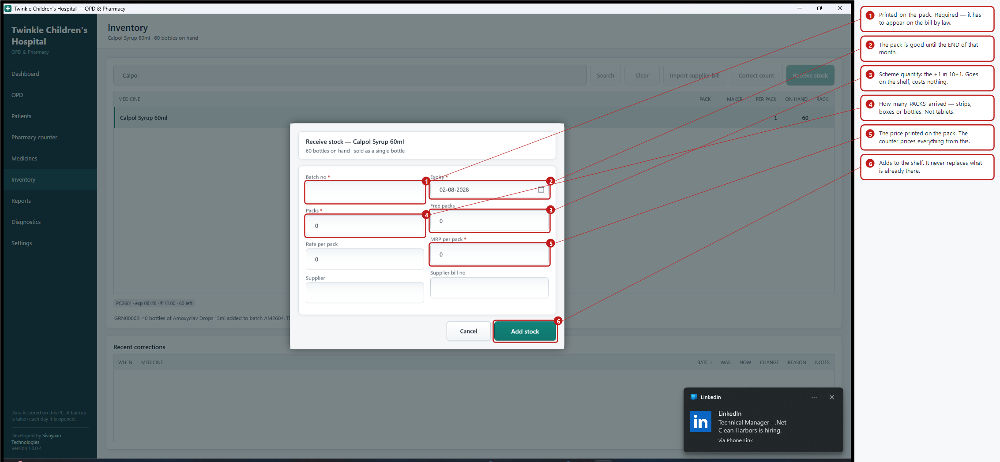

| Field | Notes |
|---|---|
| **Batch no** | Printed on the pack. **Required — it goes on the bill by law** |
| **Expiry** | The pack is good until the **end** of that month |
| **Packs** | How many **packs** arrived — strips, boxes, bottles |
| **Free packs** | Scheme quantity, the "+1" in 10+1. Adds to stock, costs nothing |
| **Rate per pack** | What the hospital paid per pack |
| **MRP per pack** | The price printed on the pack. **The counter prices from this** |
| **Supplier**, **Supplier bill no** | For your records, and what the reconciliation report matches against |
| **Add stock** | Adds it and closes the form, ready for the next line |
| **Cancel** | Closes it. Nothing goes on the shelf |

> ### Packs in, units out
>
> Above the buttons a grey line reads back what you have entered:
> *"20 pack(s) × 15 = 300 tablets onto the shelf"*. You count deliveries in
> strips, the counter sells tablets, and this is the one place the two meet —
> so it says so out loud rather than leaving you to trust it.

Everything goes when the form closes — the supplier and bill number included —
so a price, an expiry or a supplier from the last delivery can never be carried
onto the wrong batch, and a second batch can never be received against a medicine
you had forgotten was still selected.

Double-clicking a row in the grid opens this form too.

> **Adding stock always adds.** Receiving the same batch number again increases
> what is on the shelf. It never replaces it.

## Correct count

For when the shelf and the screen disagree — breakage, a miscount, or something
keyed in wrongly. Select the medicine and click **Correct count**.

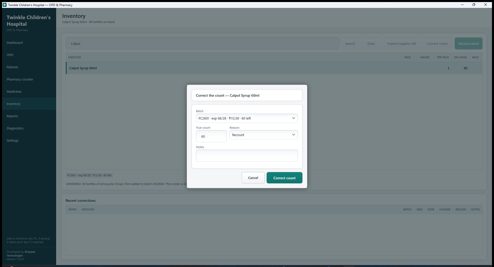

Every control, ringed and explained:

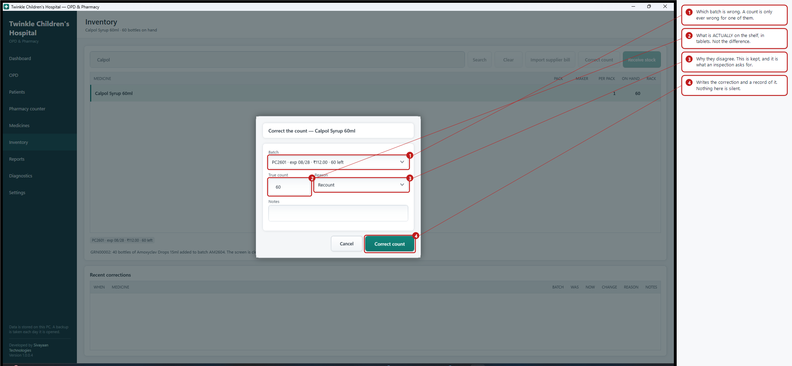

| Control | Notes |
|---|---|
| **Batch** | Which batch is wrong. Shows expiry, MRP and current count. Chosen for you when there is only one |
| **True count** | What is **actually** on the shelf, in units. Starts at what the system believes |
| **Reason** | `Recount`, `Breakage`, `Expired`, `Lost`, `Entry error`, `Other` |
| **Notes** | Free text — worth writing for anything unusual |
| **Correct count** | Applies it and closes the form |
| **Cancel** | Closes it. Nothing is corrected |

If the medicine has nothing on the shelf, the form does not open at all — it says
so instead. There is no count to put right, and an empty batch list only invites
a correction against whatever else was selected.

> ### Every correction is recorded
>
> Stock otherwise only moves by receiving or selling, and both leave a document.
> A manual correction has none, so it writes its own — otherwise a shortfall
> looks the same as theft and nobody can say what happened.
>
> The correction and its record are saved together: you cannot get one without
> the other. Setting the count to what it already is is refused, and stock cannot
> go below zero.

---

# 9. Importing a supplier bill

Instead of keying in a delivery line by line, load the file your supplier sends.
**Inventory → Import supplier bill.**


## Step 1 — choose the profile and the file

| Control | What it does |
|---|---|
| **Supplier profile** | Which supplier's format this is. Each knows that supplier's date and expiry style |
| **File** | The path. Use Browse |
| **Supplier name** | **Type this** — the file does not contain it |
| **Browse…** | Pick the file. Reads it immediately |
| **Read file** | Re-reads it after changing the profile |

## Step 2 — check what it will do

The summary line reads, for example:
*"Bill SW02236 dated 04 Jul 2026 · 9 line(s) · 9 new medicine(s) · 1042 unit(s) · net ₹15334.00"*

| Column | Meaning |
|---|---|
| **STATUS** | `Matched` — found in your catalogue · `Check` — a likely match, confirm it · `New medicine` — will be created |
| **MEDICINE**, **PACK**, **BATCH**, **EXPIRY** | As the supplier sent them |
| **PER PACK** | **Editable.** Units in one pack |
| **QTY**, **FREE** | Packs billed, and free packs |
| **UNITS** | What will land on the shelf: (qty + free) × per pack |
| **RATE**, **MRP**, **GST** | Cost, printed price, tax rate |

**What the file says** below lists everything worth knowing — the bill date it
read, MRP changes, anything it could not understand.

> ### Check the PER PACK column
>
> The file rarely states how many are in a pack. `30s` is read as 30 gummies.
> `60ML` is one bottle and stays `1` — a syrup is not sixty sellable units.
>
> For strips, **type the real number** before importing. Correct it once and the
> medicine remembers it.

## Step 3 — import

**Import** writes everything in one go. **Close** abandons it — nothing is
written until you click Import.

Afterwards it reports: *"Imported as GRN00003: 9 line(s), 9 new medicine(s), 1042
unit(s) added to stock."*

### What the import guarantees

- **Stock is added**, never replaced. 12 counted by hand plus 5 on the bill is 17
- **The same bill cannot be imported twice.** It is refused by bill number
- **Nothing is written if anything fails.** All of it, or none
- **The supplier's product codes are remembered**, so their next bill matches by itself

---

# 10. The pharmacy counter

Three steps per line: **find the medicine, set the quantity, add.**

Every control, ringed and explained:

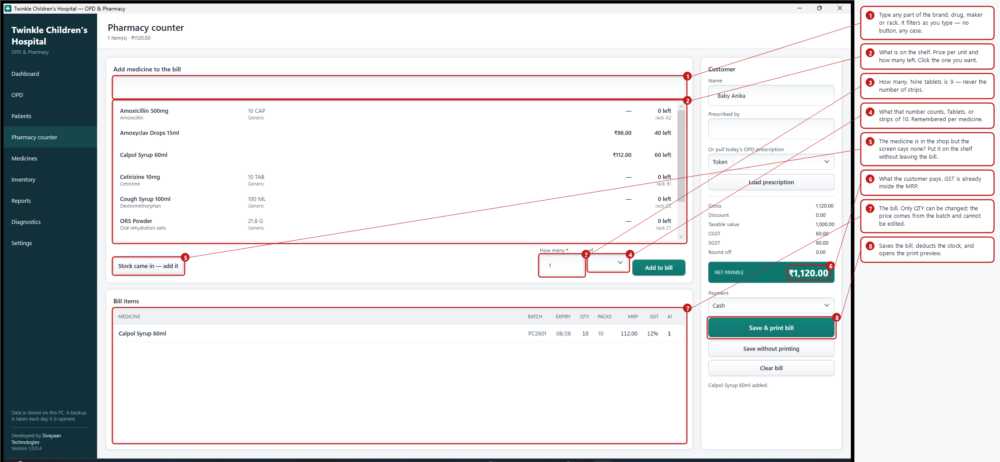

| | Control | What it is for |
|---|---|---|
| 1 | **Search** | Any part of the brand, drug, maker or rack. Filters as you type, in any case |
| 2 | **Results** | What is on the shelf: price per unit, how many left, which rack |
| 3 | **How many** | The number. Nine tablets is `9` |
| 4 | **of** | What that number counts — *tablets* or *strips of 10*. Remembered per medicine |
| 5 | **Stock came in — add it** | Puts stock on the shelf without leaving the bill |
| 6 | **Bill items** | Only QTY can be changed. The price comes from the batch |
| 7 | **Net payable** | What the customer pays. GST is already inside the MRP |
| 8 | **Save & print bill** | Saves, deducts the stock, opens the preview |

## Add medicine to the bill

| Control | What it does |
|---|---|
| **Medicine** | Type part of the name. Enter searches |
| **Find** | Runs the search |
| **Results list** | Shows pack, maker, rack and stock. Click one |
| **Batch** | **The nearest-expiry batch with stock is chosen for you** |
| **Qty (units)** | **Tablets, not strips.** `5` sells five out of a strip |
| **Add to bill** | Adds the line, then empties the search and lets go of the medicine. The bill is untouched — type the next medicine's name to carry on |
| **Stock came in — add it** | Puts stock on the shelf from here. See below |

## The medicine is in the shop but the screen says none

It happens: a delivery arrived and nobody entered it, or it was bought in as a
one-off. **Do not send the patient away and do not leave the bill.**

Click **Stock came in — add it**.

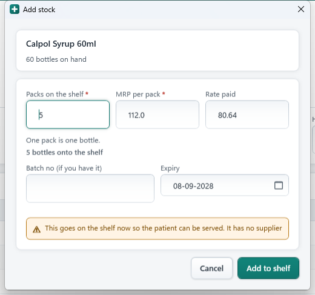

| Field | Notes |
|---|---|
| **Packs on the shelf** | How many strips, boxes or bottles you are putting in |
| **MRP per pack** | **Required** — nothing can be priced without it. Filled in from the last time this medicine came in |
| **Rate paid** | Leave it if you do not know. It can be filled in when the bill arrives |
| **Batch no** | Enter it if it is on the pack. **Leave it blank and one is allocated for you**, starting `CTR-` |
| **Expiry** | Defaults to two years out. Change it if you know better |
| **Add to shelf** | Puts it in. You come straight back to the bill |

The grey line reads back what you have entered — *"5 pack(s) × 10 = 50 tablets
onto the shelf"* — before anything is committed.

> ### What this costs you, and why it is worth it
>
> Stock added this way has **no supplier bill behind it**, so total purchases
> will not tie out against total sales until that bill turns up. That is a
> deliberate trade: a counter that stops to do paperwork with a patient waiting
> is a counter nobody uses.
>
> Nothing is hidden to buy that. Every entry is a proper goods-inward document
> with the quantity, the MRP, the date and who keyed it, and every one of them
> is listed under **Reports → Stock to reconcile** until it is matched to the
> real bill. You can square the books whenever you like — a week later, a month
> later — because nothing was done quietly.

## Bill items

| Column | Notes |
|---|---|
| **MEDICINE**, **BATCH**, **EXPIRY** | What is being handed over |
| **QTY** | Base units. Editable |
| **PACKS** | Reads back as `2 × 10 TAB + 3` |
| **MRP**, **DISC %** | Editable |
| **GST %**, **AMOUNT** | Calculated |
| **✕** | Removes the line |

## Customer (right)

| Control | Notes |
|---|---|
| **Name** | Defaults to `Guest`. **A walk-in needs no patient record** |
| **Prescribed by** | Doctor's name. Required on the bill for a Schedule H1 drug |
| **Or pull today's OPD prescription** | Pick a patient seen today |
| **Load prescription** | Puts every prescribed medicine that is in stock on the bill |

## Totals

```
Gross            what the MRP comes to
Discount         anything taken off
Taxable value    the MRP with GST taken back out of it
CGST + SGST      the tax, split in half
Round off        to the nearest rupee
NET PAYABLE      what the customer hands over
```

| Control | What it does |
|---|---|
| **Payment** | Cash, UPI or Card |
| **Transaction / reference no.** | Only shown for UPI or Card. Never required — for reconciling against the gateway or bank statement |
| **Save & print bill** | Saves and opens the preview |
| **Save without printing** | Saves only |
| **Clear bill** | Empties the counter without saving |

> ### Every bill is settled in full
>
> There is no credit and no part payment — by design, because the clinic does not
> offer them. A bill is paid before it is saved, so nothing is ever outstanding
> and there is no balance to chase.

> ### MRP already includes GST
>
> Tax is never added on top. Ten strips at ₹112 MRP come to **exactly ₹1,120** —
> of which ₹1,000 is the taxable value and ₹120 is GST.

> ### A whole strip always costs what is printed on it
>
> Five tablets from a ₹112 strip of ten cost ₹56. But a **full** strip costs
> ₹112, not ten times the rounded per-tablet price. This matters where the price
> does not divide evenly: ₹87.50 across fifteen tablets is ₹5.83 each, and the
> full strip still costs ₹87.50.

---

# 11. Diagnostics

Optional — off by default. Switched on from **Settings → Features**, and once
on it stays on; the nav button appears immediately, no restart needed. Two
tabs: **Billing** and **Test Master**.

## Billing

Every control, ringed and explained:

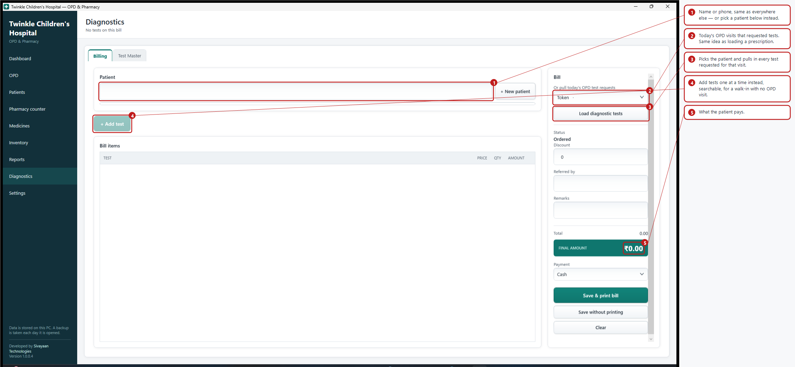

| | Control | What it is for |
|---|---|---|
| 1 | **Patient** | Search by name or phone, same as everywhere else |
| 2 | **Or pull today's OPD test requests** | Today's OPD visits that requested tests and are not yet billed |
| 3 | **Load diagnostic tests** | Picks the patient from that visit and pulls in every test requested for it |
| 4 | **+ Add test** | A searchable popup listing every active test — tick as many as needed. Only enabled once a patient is chosen |
| 5 | **Final amount** | What the patient pays |

With a patient chosen and at least one test on the bill:

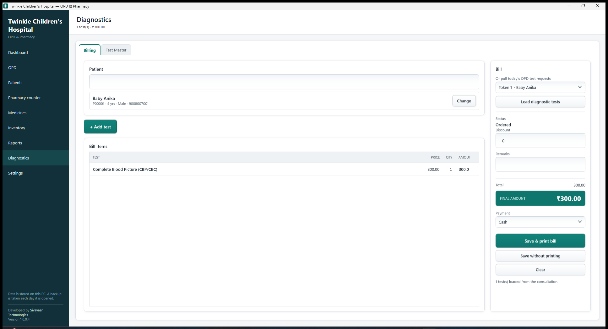

| Field | Notes |
|---|---|
| **Status** | `Ordered` until first saved — shown as plain text, since there is nothing yet to move it along. A saved bill gets a real dropdown: `Ordered → Sample Collected → Result Received → Completed` |
| **Discount** | |
| **Referred by** | **Only shown for a patient who did not come through this clinic's own OPD** — one loaded via **Load diagnostic tests** is referred by the clinic itself, so there is nothing to ask |
| **Remarks** | |
| **Payment** | Cash, UPI or Card |
| **Transaction / reference no.** | Only shown for UPI or Card. Never required |
| **Save & print bill** / **Save without printing** / **Clear** | |

A bill **Completed** can no longer be edited — the fields grey out. Move it
along the status list only as far as it has actually got.

> ### Two ways in, same result
>
> **+ Add test** is for a walk-in with no OPD visit today — search the patient,
> then search and tick tests one at a time. **Load diagnostic tests** is for
> a patient the doctor has already seen — it does the patient and every
> requested test together in one click, the diagnostics equivalent of
> **Load prescription** at the pharmacy counter. Either can add more tests
> to the same bill afterwards.

## Test Master

The list **+ Add test** and **Load diagnostic tests** both draw from.

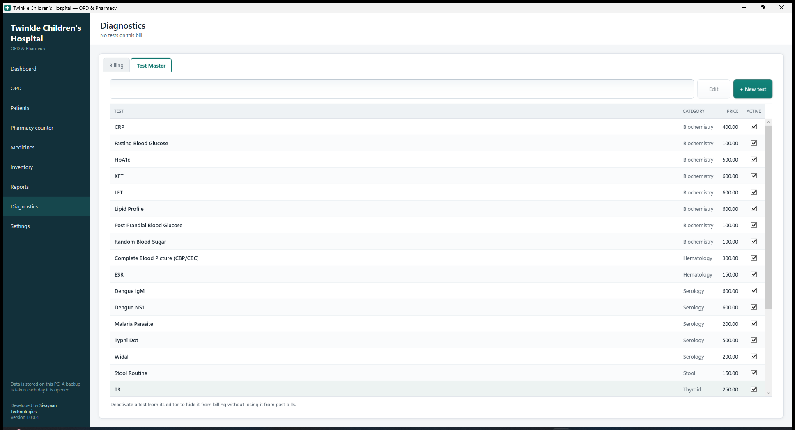

| Control | What it does |
|---|---|
| **Search** | By name or category |
| **+ New test** | Opens a popup: name, category, price |
| **Edit** | Opens the highlighted test. Double-clicking the row does the same |
| **Active** | Tick to show it in billing. Deactivate a test rather than delete it once it has been billed — past bills keep their own price regardless |

A set of common tests is preloaded on first run — complete blood picture,
blood sugar variants, liver and kidney function, thyroid, dengue and malaria
screens, urine and stool routine, vitamins, and more — editable from here.
Nothing is ever re-inserted or overwritten on a later update.

---

# 12. Patients


Search by **name, patient number or phone**. A phone number lists the whole
family.

## The register

Patient no, name, phone, age, sex and allergies, across the whole window. Click a
row to select it — the history underneath fills in with that patient's visits and
bills.

Along the top: **Search**, **Clear**, **Edit**, **New diagnostic bill** (only
once that module is on — jumps straight to Diagnostics with this patient
already chosen) and **+ New patient**.

## The patient form

**+ New patient** registers someone without booking a visit. **Edit** opens the
selected patient — as does **double-clicking the row**.

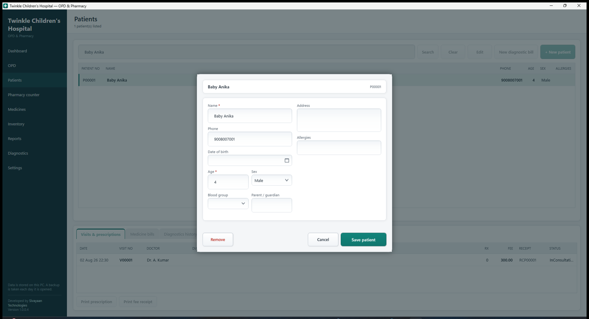

Every control, ringed and explained:

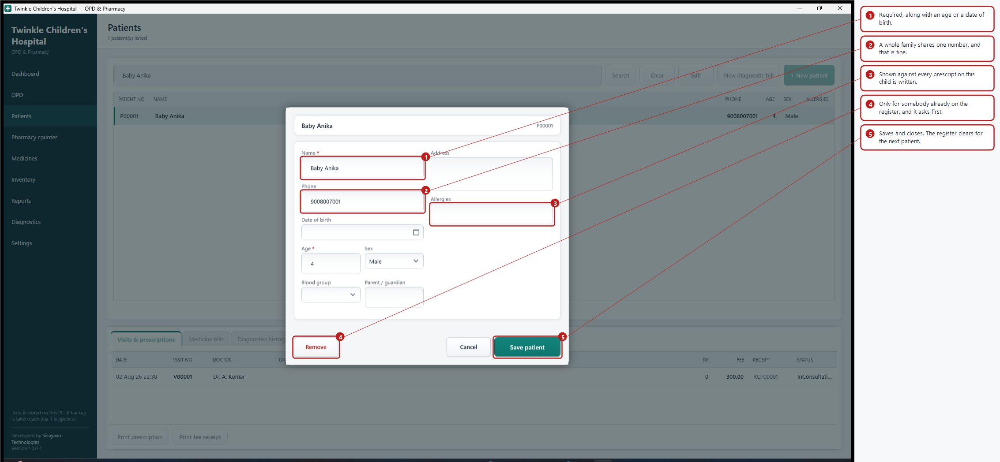

| Field | Notes |
|---|---|
| **Patient no** | Top right. Allocated on save, e.g. `P00012` |
| **Name** | Required |
| **Phone** | The parent's number. Shared across siblings is normal |
| **Date of birth** | Optional — set it and **Age fills in and locks itself**, worked out from it |
| **Age** | Required **unless a date of birth is set**. Typed directly otherwise |
| **Sex** | |
| **Blood group** | Optional |
| **Parent / guardian** | Optional, and only shown once the age is under 18 |
| **Address**, **Allergies** | Optional. Allergies show against every prescription |
| **Save patient** | Saves and closes. The register clears — search box included — for the next patient |
| **Cancel** | Closes without saving. Nothing already saved is changed |
| **Remove** | Only for somebody already registered, and it asks first. Refused if they have visits on record |

**Name, and either an age or a date of birth, are required.** Nothing else is.

> **The register clearing after Save is deliberate.** This screen used to keep the
> patient loaded in a column on the right, and typing the next child's name over
> it and pressing Save changed the child you had just registered instead of adding
> the new one — the first child left the register without a trace. Each patient
> now gets a form of its own. To carry on editing the same patient, search for
> them again and click Edit.

## History

**Visits & prescriptions** — every visit ever, with diagnosis, fee and receipt
number. Select one, then:

- **Print prescription** — prints it however long ago it was
- **Print fee receipt** — prints the receipt again, marked DUPLICATE

**Medicine bills** — every bill for this patient, with **Print bill**.

**Diagnostics history** — every diagnostic bill for this patient, with its
status and **Print bill**. Only shown once that module is on.

> This is where you go when someone returns weeks later having lost a receipt.

---

# 13. Reports


Across the top for the chosen date: pharmacy sales, cash, UPI, consultation fees
collected, and OPD visits.

| Tab | What it is for |
|---|---|
| **Day book** | Every bill for the day. **Find any bill** searches every date by bill number or customer name. **Reprint selected bill** prints it again |
| **GST summary** | Taxable value, CGST and SGST grouped by rate — what a return needs |
| **OPD register** | Every visit, diagnosis, fee, and whether it was paid |
| **Expiring soon** | Batches within 90 days of expiry. Return these to the distributor |
| **Low stock** | Anything at or below its reorder level |
| **Stock to reconcile** | Everything put on the shelf at the counter with no supplier bill behind it. See below |
| **Schedule H1 register** | Statutory record of H1 sales. **Keep for three years** |

## Stock to reconcile

When the counter adds stock to serve a patient, there is no supplier bill behind
it yet. Until there is, purchases will not tie out against sales — so every one
of those entries is listed here with the date, medicine, batch, quantity on
hand, MRP and the rate paid.

Work through it whenever it suits you. For each row, find the supplier bill it
belongs to and check the quantity and the rate against it. A batch number
starting **`CTR-`** was allocated by the system rather than read off the pack, so
those are the ones worth checking against the real batch number.

The list is not a warning and does not have to be empty. It is a worklist.

---

# 14. Printing

Everything previews before any paper moves.


**Print** sends it. **Close** goes back. If no printer is set up the application
says so plainly instead of failing, and you can still preview.

| Document | Number | Print it from |
|---|---|---|
| Tax invoice (medicines) | `INV00001` | Counter · Reports day book · patient record |
| Consultation receipt | `RCP00001` | OPD tile · patient record |
| Prescription | `V00001` | Consultation · OPD tile · patient record |

**Anything can be reprinted at any time.** A reprint is stamped **DUPLICATE** so
it cannot be mistaken for the original.

---

# 15. Worked examples

Real situations, start to finish, with the numbers.

---

## Example 1 — Nine tablets out of a strip of ten

**A mother wants only nine Paracetamol.** A strip holds ten and costs ₹30.

| Step | What you do |
|---|---|
| 1 | **Pharmacy counter** → type `parac` |
| 2 | Click **Paracetamol 500mg**. It says *"590 tablets in stock · ₹3.00 each"* |
| 3 | **How many** `9`, **of** `tablets` |
| 4 | **Add to bill** |

**What you get**

- Bill line: `0 × 10 TAB + 9 tablets`, amount **₹27.00**
- Shelf: 590 → 581 tablets
- The opened strip has one tablet left in it, and the next customer gets that first
- The search box empties, ready for the next medicine. The bill keeps the line

> **Why not ₹270?** Because the medicine says ten tablets per pack, so a tablet
> costs ₹3.00, not ₹30.00. If it charged ₹270, that medicine has **Units in one
> pack** set to 1 — see task P.

---

## Example 2 — Two whole strips

Same medicine, but the customer wants two full strips.

**How many** `2`, **of** `strips of 10` → 20 tablets, **₹60.00**.

A full strip always costs exactly the MRP printed on it. Two strips is exactly
twice that — never ₹59.90 or ₹60.10.

---

## Example 3 — The medicine is found but has no stock

**A prescription asks for Cetirizine syrup. The counter shows it, greyed, with
"out of stock" — but you can see the bottles on the shelf.**

This is the commonest situation in a new system: the delivery arrived and nobody
entered it.

| Step | What you do |
|---|---|
| 1 | Click the medicine anyway. The summary reads *"Cetirizine 10mg · out of stock"* |
| 2 | Click **Stock came in — add it** |
| 3 | **Packs on the shelf** `5`, **MRP per pack** `85.00` |
| 4 | Leave batch and expiry blank if you do not have them |
| 5 | **Add to shelf** |

**What you get**

- Five bottles on the shelf, sellable immediately
- A batch numbered `CTR-260727-1432` — allocated, not printed on the pack
- A line in **Reports → Stock to reconcile** until the supplier bill arrives

You are back on the same bill. Nothing was lost.

---

## Example 4 — The doctor prescribes something you do not stock

**Dolo syrup, which the shop has never carried.**

The doctor types the name and **does not** pick anything from the list. The hint
reads *"Not in our pharmacy — it will be written on the prescription only"*.

It is printed on the prescription and **never added to your medicine records**.
At the counter, **Load prescription** names it: *"Not added: Dolo Syrup"*. Tell
the parent to buy it outside.

---

## Example 5 — A course that spans two batches

**Twenty tablets. The oldest batch holds seventeen.**

You type `20`. The counter splits it and tells you:

> *Paracetamol: 20 from 2 batches — 15 from PC1234, 5 from PC1180.*

Two bill lines, because the batch number of what you actually hand over must be
printed. The split falls at **fifteen, not seventeen**, so one whole strip is
charged at the printed price and only five are loose — ₹116.65, the same as if
one batch had covered it.

On the printed bill both lines sit under one **Paracetamol** heading, so it does
not read as two separate items.

---

## Example 6 — Nine tablets, but only six left

You type `9`. Nothing is added, and it says:

> *Only 6 tablets of Paracetamol 500mg left to sell.*

Sell the six, or add stock. It never quietly sells you fewer than you asked for.

---

## Example 7 — A sealed pack that cannot be split

**ORS sachets, sold as a box of ten, "Sell loose units" unticked.**

You type `7` and it refuses:

> *ORS Powder is not sold loose — it goes out in whole packs of 10. Enter 10 for
> 1 pack.*

Untick that box on any medicine that must leave the shop whole.

---

## Example 8 — A whole visit

**Aarav, four years old, fever.**

| Step | Screen | What happens |
|---|---|---|
| 1 | OPD → **+ New visit** | Booked, token 4 |
| 2 | Tile → **Fee** | ₹300 taken, receipt printed |
| 3 | Tile → **Consult** | Fever, viral fever, three medicines prescribed |
| 4 | Counter → **Load prescription** | Paracetamol added; Cetirizine reported *no stock*; Dolo reported *not added* |
| 5 | **Stock came in — add it** | Five bottles of Cetirizine on the shelf |
| 6 | **Load prescription** again | Both now on the bill |
| 7 | **Save & print bill** | 9 tablets + 1 bottle = **₹112.00** |

The parent buys the Dolo syrup outside. Everything else is on one bill, with
batch numbers and expiry printed on it.

---

# 16. What the system will and will not do

Worth reading once. It is the difference between trusting a number and checking it.

## Situations it handles for you

| Situation | What happens |
|---|---|
| **A child needs 9 tablets from a strip of 10** | Priced per tablet, nine come off the shelf, and the bill shows `0 × 10 TAB + 9` |
| **A course needs 20 but the oldest batch holds 15** | Split across two batches, two lines, both batch numbers on the bill. Nearest expiry goes first |
| **A course needs 20 and there are only 12** | It bills 12 and says *"Short: Amoxicillin (12 of 20)"*. It never quietly bills less without telling you |
| **A strip of 15 and a strip of 10 of the same drug** | Each batch prices against the pack it actually came in. Old stock is never repriced |
| **A medicine is prescribed that you do not stock** | Written on the prescription, named at the counter, never added to your records |
| **A medicine has run out mid-queue** | Add it from the counter — see [section 10](#the-medicine-is-in-the-shop-but-the-screen-says-none) |
| **A doctor requests a lab test during consultation** | **Load diagnostic tests** at the Diagnostics desk pulls it in with the patient already chosen — see [section 11](#11-diagnostics) |
| **A patient's age is not known exactly** | Enter a date of birth instead and age is worked out and kept current, not typed once and left to go stale |
| **Stock is expired** | Never dispensed. It stays on the shelf listing so you can see it and return it |
| **A sealed pack that cannot be split** | Untick **Sell loose units** and the counter insists on whole packs, telling you the number to type |
| **A Schedule H1 medicine** | Cannot be saved without the prescribing doctor. It goes in the register automatically |
| **Two people on one phone number** | Both appear when you search. You pick which child is here |
| **Two patients registered one after the other** | The screen clears after each save, so the second is a new record. It cannot overwrite the first |
| **A batch expiring within a month** | Still sold first, and the counter says so before the customer leaves — batch, month and days remaining |
| **The same supplier bill loaded twice** | Refused. The invoice number is what stops it |
| **The same batch delivered again** | **Added** to what is there. Never replaced |
| **The count on the shelf is wrong** | Correct it with a reason. Every correction is recorded with was, now and why |
| **A printer is not attached** | Everything previews on screen first. Nothing is lost by not printing |
| **The power goes off mid-bill** | Nothing is half-saved. A bill either exists completely or not at all |
| **Something unexpected fails** | It says so in plain words and keeps running. Your saved data is safe |

## Situations it does not handle — check these yourself

| Situation | What you need to know |
|---|---|
| **A customer returns medicine** | **There are no returns in this version.** Do it on paper and correct the stock count with reason *Other* and a note |
| **Part payment, or paying later** | Not supported, on purpose. A bill is paid in full when it is saved |
| **Purchases balanced against sales** | Will **not** tie out while anything sits in **Reports → Stock to reconcile**. That list is the gap, and it is deliberate |
| **The rate paid on counter-added stock** | Defaults to zero, so anything added that way looks like pure margin until you fill the real rate in |
| **No discounts** | The counter charges MRP. There is no discount box, by choice |
| **A batch more than a month from expiry** | Sold first, correctly, but not flagged. Watch **Expiring soon** for what to return |
| **Two people billing at once** | One PC, one till. This is not built for two counters on the same data |
| **Changing units per pack after stock exists** | Offered as a re-count, and you should accept it. Declining leaves the shelf being sold by the pack |
| **A medicine deleted or made inactive with stock on it** | It disappears from the counter but the stock is still counted in reports |
| **Anyone can do anything** | There are no logins or permissions. Everyone using the PC has the same rights |

> ### The one number to sanity-check daily
>
> **Reports → the totals along the top.** The day's takings in the drawer should
> match pharmacy sales plus fees collected. A bill line can no longer be
> repriced, so a difference means cash was taken out or a bill was not saved —
> both worth finding on the day rather than at month end.

---

# 17. When something goes wrong

## The application does not close on an error

If something unexpected happens it tells you in plain words, writes the details
to the log, and **keeps running**. A half-typed bill is not lost. You will see a
message like:

> *Taking the fee could not be completed. The change could not be saved — it may
> already exist, or a required field is missing. Nothing was changed.*

## Things it refuses on purpose

| It says | Why |
|---|---|
| "Only 3 × 10 TAB + 4 left of …" | You cannot sell stock you do not have |
| "Batch … expired on …" | Expired medicine cannot be dispensed |
| "3 people match that. Select which one" | Siblings share a phone; the wrong child is worse than a second click |
| "This patient has visits on record" | Deleting them would orphan their bills |
| "Bill … was already received on …" | Importing twice would double your stock |
| "No MRP" during import | The counter prices from MRP and cannot sell without one |
| "Batch number is required" | It has to appear on the bill by law |

## Your data

Everything is in one file: `C:\ProgramData\TwinkleHMS\twinkle.db`. Copy that file
and you have copied the clinic.

**Backups** are automatic — one per day into `C:\ProgramData\TwinkleHMS\backups`,
keeping the last 14. That protects against mistakes, **not against the PC dying**.
Copy the folder to a pen drive weekly.

**The log** is at `C:\HMS\Logs`, one file per day, 30 days kept. Settings has an
**Open log folder** button and shows the exact path. Send that day's file when
reporting a problem.

## Changing where things are kept

`appsettings.json` sits next to the application and can be edited in Notepad.
Restart the application afterwards.

```json
{
  "LogDirectory": "C:\\HMS\\Logs",
  "DatabasePath": null,
  "BackupsToKeep": 14,
  "LogDaysToKeep": 30
}
```

| Setting | Notes |
|---|---|
| `LogDirectory` | Where daily logs are written |
| `DatabasePath` | Full path to the database file. `null` uses `C:\ProgramData\TwinkleHMS\twinkle.db` |
| `BackupsToKeep` | Daily database backups kept before the oldest is deleted |
| `LogDaysToKeep` | Days of logs kept |

Use double backslashes in paths, as above.

> If the folder cannot be written to — a locked-down PC, or a network drive that
> is offline — the application does **not** fail. It falls back to
> `C:\ProgramData\TwinkleHMS\logs`, and the first line of the log says which
> folder it wanted and which it used. The same applies to a settings file with a
> typo in it: built-in defaults are used and the log says so.

## Not in this version

Sales returns and credit notes · purchase returns · inter-state IGST ·
e-invoicing · multi-terminal use · the Schedule X narcotic register.

**Credit and part payment are not missing — they are deliberately absent.** The
clinic settles every bill in full at the counter, so there is no outstanding
balance anywhere in the system and nothing to reconcile.

The GST arithmetic and the invoice layout are correct for a retail counter, but
this is not a certified e-invoicing integration. Have a CA review the GST summary
before it feeds a return, and confirm register formats with your local drug
inspector.
